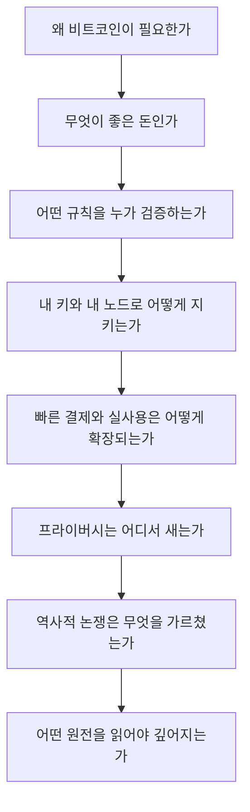

> [!info] 빠른 연결
> 허브: [[00_메타/index]]
> 함께 보기: [[index]] · [[00_메타/노드 인벤토리]]

이 문서는 개별 문서보다 **폴더 간의 강한 연결**을 보여 주기 위한 지도다. 비트코인을 이해할 때 가장 흔한 실패는, 철학은 철학대로 읽고 기술은 기술대로 읽고 지갑은 지갑대로 읽는 것이다. 하지만 실제 비트코인은 그 모든 층위가 한 덩어리로 움직인다.

## 핵심 연결축

## 폴더별 역할

### [[01_통화철학/index]]
돈, 희소성, 시간선호, 사이퍼펑크, 레이어드 머니, 맥시멀리즘을 다룬다. 이 폴더를 먼저 읽으면 비트코인을 “차트”로 보지 않게 된다.

### [[02_프로토콜/index]]
비트코인이 어떤 규칙을 집행하고, 왜 UTXO와 서명, 스크립트, 멤풀, 합의가 그런 형태를 취하는지 설명한다. 철학을 구조로 바꾸는 폴더다.

### [[03_업그레이드와_개발/index]]
돈의 기반층은 어떻게 바뀌는가를 다룬다. BIP, Soft fork, UASF, SegWit, Taproot, Silent Payments 같은 주제가 여기서 연결된다.

### [[04_보관과_운영/index]]
“Not your keys, not your coins”를 실전 절차로 번역한다. 지갑 선택, 백업, 복구, 멀티시그, 노드 운영, 상속이 모두 여기 있다.

### [[05_채굴과_인프라/index]]
작업증명, 난이도 조정, 발행 스케줄, 풀 중앙화, 에너지 시장, Stratum V2 같은 산업적 층위를 다룬다. 비트코인의 보안 예산을 현실 세계로 연결하는 폴더다.

### [[06_라이트닝/index]]
라이트닝을 온체인과 대립하는 별도 체인이 아니라, 결제 레이어이자 운영 기술로 다룬다. 채널, HTLC, 라우팅, 유동성, BOLT12, 스플라이싱, 구현체 비교가 핵심이다.

### [[07_프라이버시와_실사용/index]]
주소 재사용, KYC, CoinJoin, Silent Payments, Tor, BTCPay 같은 실전 프라이버시 문제를 다룬다. 좋은 프라이버시는 기능보다 습관이라는 점을 강조한다.

### [[08_역사와_논쟁/index]]
사토시 초기 역사, 블록사이즈 워, 위키리크스, ETF와 수탁, Ordinals, 소프트포크 정치학 같은 사건을 통해 비트코인 문화의 기억을 정리한다.

### [[09_도서와_자료/index]]
백서, BIP, 한국어 해설서, 사용 가이드, 독서 지도, ATOMIC BITCOIN 추천 도서를 모아 읽기 순서를 제시한다. 이 위키의 서지 엔진이다.

### [[10_인물/index]]
사토시, 할 피니, 아담 백, 닉 재보, 피터 우일러, 그렉 맥스웰, 필레몬, ATOMIC BITCOIN 등 인물 축을 통해 사상과 기술의 계보를 묶는다.

## 권장 읽기 루프

좋은 독서는 직선이 아니라 루프다. 예를 들면 다음과 같다.

- [[01_통화철학/사이퍼펑크]] -> [[08_역사와_논쟁/사이퍼펑크전자현금계보]] -> [[02_프로토콜/백서개관]]
- [[02_프로토콜/노드와합의]] -> [[08_역사와_논쟁/블록사이즈워]] -> [[03_업그레이드와_개발/소프트포크활성화와UASF]]
- [[04_보관과_운영/개인지갑사용가이드]] -> [[07_프라이버시와_실사용/거래소출금과보관분리]] -> [[04_보관과_운영/풀노드운영가이드]]
- [[06_라이트닝/라이트닝개요]] -> [[06_라이트닝/유동성관리와수익모델]] -> [[06_라이트닝/라이트닝구현체비교]]

이 루프를 여러 번 돌다 보면 비트코인을 더 이상 단일 정의로 붙잡으려 하지 않게 된다. 그것이 이 위키의 목적이다.

## 보충 해설

이 문서를 메타 문서로 읽는다는 것은 내용을 '사실 목록'이 아니라 '경로 설계'로 읽는다는 뜻이다. 비트코인은 주제가 넓고, 같은 단어가 철학·프로토콜·운영·정치의 층위에서 다른 의미를 띠기 쉽다. 그래서 메타 문서의 역할은 정답을 던지는 것이 아니라, 어떤 순서로 들어가면 개념이 서로를 비추기 시작하는지 보여 주는 데 있다.

좋은 비트코인 위키는 단순히 많이 아는 위키가 아니라, 다른 수준의 독자를 서로 다른 진입로로 안내할 수 있는 위키다. 입문자는 핵심 개념을 잃지 않아야 하고, 중급자는 연결을 볼 수 있어야 하며, 고급 독자는 원전과 논쟁의 갈림길을 재구성할 수 있어야 한다. 이 폴더는 그 세 층을 묶어 주는 조타실 역할을 맡는다.

## 지도는 요약이 아니라 구조 설명이다
전체 지도 문서는 모든 문서를 짧게 설명하는 곳이 아니라, 폴더 간의 힘의 흐름을 보여 주는 곳이다. 돈의 철학이 왜 프로토콜 문서의 의미를 정당화하는지, 프로토콜이 왜 셀프커스터디 문서로 내려오는지, 셀프커스터디가 왜 프라이버시와 역사 논쟁까지 연결되는지를 한눈에 볼 수 있어야 한다. 그래야 독자는 지금 자신이 읽는 한 문서가 전체 구조물 안에서 어디쯤에 놓이는지 판단할 수 있다.

특히 이 위키는 '통화철학 -> 프로토콜 -> 셀프커스터디 -> 라이트닝/프라이버시 -> 역사 논쟁 -> 독서 자료'라는 흐름을 중심축으로 삼는다. 이 순서는 절대적 교과서 순서가 아니라, 가장 적은 오해로 많은 연결을 얻기 쉬운 동선이다. 전체 지도는 그 동선을 압축해 보여 주는 관제탑 역할을 한다.

## 연결해서 읽기

이 문서는 [[00_메타/index]] · [[index]] · [[00_메타/노드 인벤토리]]와 함께 읽을 때 입체감이 커진다. [[00_메타/index]] 문서는 읽는 경로와 구조 층위를 보강한다 / [[index]] 문서는 전체 허브 층위를 보강한다 / [[00_메타/노드 인벤토리]] 문서는 읽는 경로와 구조 층위를 보강한다. 한 문서를 읽고 바로 이웃 문서로 건너가는 식으로 그래프를 타면, 같은 개념이 철학·기술·운영·역사 중 어느 층에서 다시 등장하는지 빠르게 감이 잡힌다.

특히 전체 지도 같은 문서는 단독 정의보다 연결 속에서 의미가 커진다. 비트코인 지식은 선형 교재보다 네트워크 구조에 가깝기 때문에, 인접 노드 한두 개만 함께 읽어도 오해가 크게 줄어드는 경우가 많다.

## 스스로 점검할 질문

이 문서를 읽고 나면 적어도 세 가지 질문에는 자기 언어로 답해 볼 수 있어야 한다. 이 문서가 풀어 주는 핵심 질문은 무엇인가, 어떤 인접 문서가 이 이해를 교정하는가, 지금 내 공부에서 어디에 연결되는가. 이 질문에 막히는 부분이 있다면 아직 개념 하나가 덜 붙은 것이므로, 바로 옆 문서와 함께 다시 읽는 편이 좋다.

## 보충 메모

'전체 지도' 문서는 이 위키에서 구조와 항해법 축을 지탱하는 노드다. 그래서 핵심 정의만 이해하는 것으로는 충분하지 않고, 그 정의가 다른 문서에서 어떻게 다시 쓰이는지까지 보는 편이 좋다. 비트코인 공부가 어려운 이유는 개념 수가 많아서가 아니라, 같은 개념이 여러 층에서 다른 역할을 맡기 때문이다.

독자가 지금 당장 모든 세부를 기억할 필요는 없다. 다만 이 문서의 문제의식이 왜 [[index]]로 돌아가 다른 갈래와 연결되는지, 그리고 왜 이 문서를 읽은 뒤 다시 실전 문서나 역사 문서로 건너가야 하는지만 분명히 붙잡으면 된다. 그런 식으로 왕복 독서를 할수록 지식은 목록이 아니라 구조가 된다.
