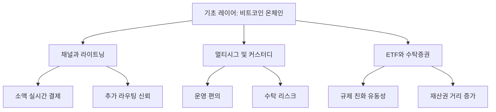

> [!info] 빠른 연결
> 허브: [[01_통화철학/index]]
> 먼저 읽기: [[01_통화철학/화폐의 성질]] · [[02_프로토콜/노드와합의]]
> 함께 보기: [[06_라이트닝/라이트닝개요]] · [[08_역사와_논쟁/ETF기관화와국가]] · [[09_도서와_자료/도서/레이어드 머니 도서]]

레이어드 머니는 비트코인을 이해할 때 매우 유용한 틀이다. 핵심은 모든 돈이 항상 동일한 층에 있지 않다는 점이다. 어떤 돈은 최종 결제 자산이고, 어떤 돈은 그 자산에 대한 청구권이며, 또 어떤 돈은 신용과 유동성 편의를 위해 상위 층 위에 구축된 계약이다. 금본위 시대의 금, 중앙은행 준비금, 상업은행 예금, 카드 결제는 서로 다른 레이어였다.

비트코인도 마찬가지다. [[02_프로토콜/UTXO]]와 [[02_프로토콜/노드와합의]]가 유지하는 온체인 레이어가 있고, 그 위에 [[06_라이트닝/라이트닝개요]] 같은 빠른 결제 레이어, 커스터디 서비스, 증권화 상품, 회계 단위, 회수 불가능한 영수증형 청구권까지 다양한 층이 올라간다. 맥시멀리스트 관점에서 중요한 질문은 단순하다. **어느 레이어가 편의를 주는 대신 어떤 신뢰 가정을 되돌려 넣는가**다.

## 비트코인 레이어 구조

## 왜 중요한가

비트코인 초심자가 가장 자주 하는 실수 중 하나는 모든 BTC 노출을 동일하게 취급하는 것이다. 거래소 계정, ETF 지분, 라이트닝 채널 잔고, 멀티시그 금고의 UTXO는 같은 가격에 연동될 수 있지만, **소유권의 질과 결제 확정성의 층위는 전혀 다르다**. 레이어드 머니 관점은 이 차이를 선명하게 드러낸다.

이 틀은 비트코인을 순수 기술 프로젝트로만 보지 않게 도와준다. 실제 사회는 결제 속도, 회계 편의, 규제 적합성, 사용자 경험 때문에 상위 레이어를 항상 만들어 낸다. 따라서 질문은 “레이어를 허용할 것인가”가 아니라 “레이어가 기초 자산의 성질을 훼손하지 않게 어떻게 설계할 것인가”다.

## 맥시멀리스트 해석

맥시들은 상위 레이어의 존재 자체를 부정하지 않는다. 오히려 비트코인이 세계 통화가 되려면 다양한 레이어가 필연적으로 생긴다고 본다. 다만 중요한 것은 **기초 레이어의 검증 가능성, 무허가성, 공급 규칙, 셀프커스터디 가능성**이 상위 레이어 때문에 타협되어서는 안 된다는 점이다. 중앙화된 상위 레이어가 전부를 압도하면, 사회는 다시 익숙한 신용 피라미드로 돌아간다.

그래서 [[06_라이트닝/라이트닝개요]]는 긍정적으로 평가받지만, 무제한 재담보와 불투명한 수탁 청구권은 비판받는다. 레이어는 확장 수단이지, 기초 규칙의 대체물이 아니다.

## 책과 현실

[[09_도서와_자료/도서/레이어드 머니 도서]]는 이 구조를 역사 통화 시스템과 결부해 풀어낸다. 그 독법의 장점은 “비트코인 위에 무엇이 생길 것인가”를 추상적 상상이 아니라 과거 통화사와 결제 인프라의 반복 패턴 속에서 읽게 만든다는 데 있다. 다만 현실 설계에 들어가면 각 레이어의 신뢰 비용을 구체적으로 감사해야 한다. 그 작업은 [[04_보관과_운영/위협모델과실수패턴]]과 [[07_프라이버시와_실사용/결제인프라와BTCMap과BTCPay]] 문서가 이어받는다.

## 참고 문헌과 원전

- Nik Bhatia, *Layered Money*.
- 금본위와 현대 은행 시스템의 layered settlement 구조에 관한 일반 통화사.
- Lightning Network 설계 문서와 결제 레이어 연구.

## 보충 해설

통화철학 문서는 가격 전망이나 투자 언어와는 다르게 읽어야 한다. 여기서 중요한 것은 '비트코인이 오를까'가 아니라, 어떤 돈이 장기 저축을 가능하게 하고 어떤 제도가 시간선호를 뒤틀어 놓는가다. 그래서 이 폴더의 글들은 기술 문서의 전제이자, 실사용 문서의 의미를 정당화하는 배경으로 읽을 때 가장 힘을 얻는다.

또한 철학 문서라고 해서 현실에서 멀리 있는 것도 아니다. 화폐의 성질, 저축의 윤리, 검열 저항, 자발적 질서 같은 말은 모두 사용자의 행동 규칙으로 내려온다. 노드를 돌릴지, 수탁 대신 셀프커스터디를 택할지, 레이어드된 신용 구조를 어떻게 경계할지 같은 실천은 결국 이 폴더의 어휘로 다시 설명된다.

## 기초 자산과 상위 신용층의 긴장
레이어드 머니 관점의 핵심은 돈이 항상 한 층으로만 존재하지 않는다는 데 있다. 기초 자산이 있고, 그 위에 보관증서와 예치금, 지급 결제 네트워크, 신용 계약, 파생상품이 쌓인다. 문제는 상위 레이어가 편의를 제공하는 동시에, 기초 자산과의 거리를 벌리며 검증을 희석시킬 수 있다는 점이다. 비트코인을 이해할 때 이 관점이 중요한 이유는, 비트코인이 기초 자산 자체를 디지털 원장 위에서 직접 검증 가능한 형태로 제시한다는 데 있다.

맥시 관점에서 레이어드 구조는 악이 아니라 필연이다. 라이트닝, 페더레이션, 각종 서비스 사업자는 모두 어떤 형태로든 상위 레이어를 만든다. 다만 핵심은 상위 레이어가 기초 레이어의 불변 규칙과 셀프커스터디 가능성을 잠식하지 않게 하는 것이다. 이 문서를 읽을 때는 '레이어가 생기느냐 마느냐'보다 '어떤 레이어가 언제, 누구에게, 어떤 검증 권한을 남겨 주는가'를 묻는 편이 생산적이다.

## 연결해서 읽기

이 문서는 [[01_통화철학/index]] · [[01_통화철학/화폐의 성질]] · [[02_프로토콜/노드와합의]]와 함께 읽을 때 입체감이 커진다. [[01_통화철학/index]] 문서는 철학적 전제 층위를 보강한다 / [[01_통화철학/화폐의 성질]] 문서는 철학적 전제 층위를 보강한다 / [[02_프로토콜/노드와합의]] 문서는 규칙과 검증 구조 층위를 보강한다. 한 문서를 읽고 바로 이웃 문서로 건너가는 식으로 그래프를 타면, 같은 개념이 철학·기술·운영·역사 중 어느 층에서 다시 등장하는지 빠르게 감이 잡힌다.

특히 레이어드 머니 같은 문서는 단독 정의보다 연결 속에서 의미가 커진다. 비트코인 지식은 선형 교재보다 네트워크 구조에 가깝기 때문에, 인접 노드 한두 개만 함께 읽어도 오해가 크게 줄어드는 경우가 많다.

## 스스로 점검할 질문

이 문서를 읽고 나면 적어도 세 가지 질문에는 자기 언어로 답해 볼 수 있어야 한다. 이 문장이 어떤 행동 규칙으로 내려오는가, 저축과 검증의 관계는 무엇인가, 국가·시장·기술의 경계는 어디에 놓이는가. 이 질문에 막히는 부분이 있다면 아직 개념 하나가 덜 붙은 것이므로, 바로 옆 문서와 함께 다시 읽는 편이 좋다.

## 보충 메모

'레이어드 머니' 문서는 이 위키에서 돈과 저축의 철학 축을 지탱하는 노드다. 그래서 핵심 정의만 이해하는 것으로는 충분하지 않고, 그 정의가 다른 문서에서 어떻게 다시 쓰이는지까지 보는 편이 좋다. 비트코인 공부가 어려운 이유는 개념 수가 많아서가 아니라, 같은 개념이 여러 층에서 다른 역할을 맡기 때문이다.

독자가 지금 당장 모든 세부를 기억할 필요는 없다. 다만 이 문서의 문제의식이 왜 [[index]]로 돌아가 다른 갈래와 연결되는지, 그리고 왜 이 문서를 읽은 뒤 다시 실전 문서나 역사 문서로 건너가야 하는지만 분명히 붙잡으면 된다. 그런 식으로 왕복 독서를 할수록 지식은 목록이 아니라 구조가 된다.
