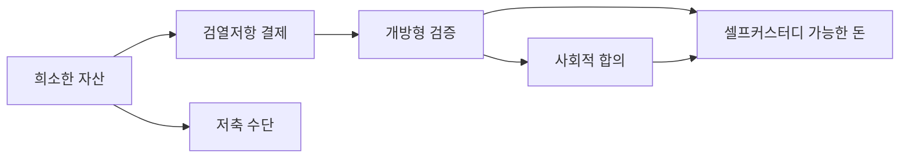

> [!info] 빠른 연결
> 허브: [[01_통화철학/index]]
> 먼저 읽기: [[00_메타/전체 지도]]
> 함께 보기: [[01_통화철학/화폐의 성질]] · [[02_프로토콜/노드와합의]] · [[04_보관과_운영/개인지갑사용가이드]]
>
> 이 문서는 비트코인을 가격표가 달린 자산이 아니라, 규칙·에너지·사회적 채택이 겹친 구조물로 정의한다.

비트코인을 “디지털 금”이라고만 부르면 절반만 맞다. “인터넷 돈”이라고만 부르면 역시 절반만 맞다. 비트코인은 **디지털 희소성, 최종결제성, 셀프커스터디 가능성, 그리고 개방형 검증**을 동시에 결합한 통화 프로토콜이다. 핵심은 단순한 토큰 발행이 아니라, 아무도 믿지 않아도 되는 규칙 집합과 그 규칙을 각자가 검증할 수 있는 구조에 있다.

공급량 2,100만 개만으로 비트코인이 설명되지는 않는다. 공급량이 제한되어도 누군가가 원장을 임의로 수정하거나, 검열하거나, 셀프커스터디를 차단할 수 있다면 그 자산은 정치적으로 중립적이지 않다. 비트코인의 독자성은 [[02_프로토콜/노드와합의]]가 누구에게나 열려 있고, 그 합의가 [[05_채굴과_인프라/채굴과난이도조정]]이라는 비용 구조를 통해 방어되며, 최종적으로는 사용자가 [[04_보관과_운영/개인지갑사용가이드]]와 [[04_보관과_운영/풀노드운영가이드]]를 통해 직접 검증할 수 있다는 데 있다.

## 공식 문서 기준 핵심 정의

- [[https://bitcoin.org/en/bitcoin-paper.html|비트코인 백서]]는 비트코인을 "peer-to-peer electronic cash system"으로 제시하고, 중앙 발행자 대신 네트워크 참가자가 거래 순서를 증명하는 구조를 설명한다.
- [[https://developer.bitcoin.org/devguide/block_chain.html|Bitcoin Developer Guide - Block Chain]]는 각 풀노드가 **자신이 검증한 블록만** 저장하며, UTXO만 유효한 입력으로 사용할 수 있다고 설명한다.
- [[https://developer.bitcoin.org/devguide/wallets.html|Bitcoin Developer Guide - Wallets]]는 지갑을 단순 잔고 앱이 아니라 공개키 배포, 서명, 네트워크 상호작용이 분리될 수 있는 체계로 설명한다.

즉 비트코인은 단순히 “발행량이 적은 자산”이 아니라, **검증 가능한 거래 원장, UTXO 기반 소유 구조, 개인 키를 통한 자기 보관**이 결합된 시스템으로 이해하는 편이 정확하다.

## 비트코인의 네 가지 층위

## 세 가지 정의

첫째, 비트코인은 **자산**이다. 사용자는 시간을 가로질러 구매력을 보존하려는 의도로 비트코인을 축적한다. 이때 중요한 것은 단기 가격이 아니라 장기적으로 누구도 공급 규칙을 임의로 바꾸기 어렵다는 믿음이다. 둘째, 비트코인은 **결제망**이다. 상대와 직접 최종 결제를 할 수 있고, 필요하면 [[06_라이트닝/라이트닝개요]]를 통해 더 작은 금액과 높은 빈도의 거래를 처리한다. 셋째, 비트코인은 **사회적 합의 프로토콜**이다. 사람들은 같은 코드를 돌린다는 이유만이 아니라, 어떤 규칙을 정당한 규칙으로 인정할지에 대해 느슨하게 합의하기 때문에 같은 네트워크에 속한다.

이 세 정의는 서로 대체 관계가 아니다. 오히려 각 정의가 다른 정의의 전제가 된다. 자산으로서의 신뢰는 결제망으로서의 유용성에서 강화되고, 결제망의 유용성은 합의 프로토콜의 신뢰성에서 나온다. 그래서 “비트코인은 결제용인가, 저축용인가”라는 질문은 잘못 설정된 경우가 많다. 좋은 기축 자산은 대개 결제 인프라와 저축 인센티브를 동시에 재편한다.

## 왜 공급량만으로는 부족한가

공급량 제한은 필요조건이지만 충분조건은 아니다. 역사에는 희소했지만 검증이 닫혀 있거나, 보관이 권력 구조에 종속된 자산이 많았다. 금은 희소했지만 물리적 보관과 수송 비용이 컸고, 국가와 은행은 그 위에 신용층을 쌓으면서 다시 중앙집중화했다. 비트코인이 다른 지점은 **희소성과 검증 가능성을 동시에 디지털화**했다는 데 있다.

이 점은 [[01_통화철학/레이어드머니]]와도 연결된다. 기축 자산이 신용층 위에 놓일수록 “누가 언제 최종결제할 수 있는가”가 중요해진다. 비트코인이 스스로를 지키는 힘은, 최종결제 자산 자체를 네트워크 참가자가 직접 보유하고 검증할 수 있게 만든 데서 나온다.

## 비트코인의 정치철학

비트코인은 정당이나 국가 이념의 프로그램이 아니다. 그러나 매우 분명한 정치적 함의를 갖는다. [[01_통화철학/사이퍼펑크]] 전통이 강조한 것은 “권력을 설득하는 것”이 아니라 “권력이 개입할 수 없는 설계를 만드는 것”이었다. 비트코인은 이 태도를 화폐와 결제의 영역으로 끌고 왔다.

동시에 비트코인은 [[01_통화철학/오스트리아학파]]가 주목한 자발적 질서, 시간선호, 통화왜곡의 문제를 실제 네트워크 수준에서 시험한다. 바로 이 지점 때문에 많은 사람들이 비트코인을 단지 금융 자산이 아니라 **문명 수준의 저축 기술**로 본다.

## 오해하기 쉬운 지점

비트코인은 즉시 모든 것을 대체하는 만능기계가 아니다. 기축 통화가 되는 과정은 길고, 신용층과 법·회계 인프라의 변화가 뒤따라야 한다. 또한 가격 변동성, 사용자 경험, 수탁 서비스의 유혹, 규제 마찰 같은 현실적 장애가 분명히 존재한다. [[06_라이트닝/라이트닝실사용가이드]]와 [[07_프라이버시와_실사용/결제인프라와BTCMap과BTCPay]]는 이런 현실 문제를 다룬다.

그럼에도 비트코인이 중요한 이유는 완전무결해서가 아니라, **누가 봐도 검증 가능한 규칙을 중심으로 통화 질서를 재구성할 수 있다는 가능성**을 실제로 보여 주기 때문이다.

## 참고 문헌과 원전

- 1차 출처:
  - [[https://bitcoin.org/en/bitcoin-paper.html|Bitcoin: A Peer-to-Peer Electronic Cash System]]
  - [[https://developer.bitcoin.org/devguide/block_chain.html|Bitcoin Developer Guide - Block Chain]]
  - [[https://developer.bitcoin.org/devguide/wallets.html|Bitcoin Developer Guide - Wallets]]
- 해설 참고:
  - Nick Bhatia, *Layered Money*
  - Saifedean Ammous, *The Bitcoin Standard*

## 보충 해설

통화철학 문서는 가격 전망이나 투자 언어와는 다르게 읽어야 한다. 여기서 중요한 것은 '비트코인이 오를까'가 아니라, 어떤 돈이 장기 저축을 가능하게 하고 어떤 제도가 시간선호를 뒤틀어 놓는가다. 그래서 이 폴더의 글들은 기술 문서의 전제이자, 실사용 문서의 의미를 정당화하는 배경으로 읽을 때 가장 힘을 얻는다.

또한 철학 문서라고 해서 현실에서 멀리 있는 것도 아니다. 화폐의 성질, 저축의 윤리, 검열 저항, 자발적 질서 같은 말은 모두 사용자의 행동 규칙으로 내려온다. 노드를 돌릴지, 수탁 대신 셀프커스터디를 택할지, 레이어드된 신용 구조를 어떻게 경계할지 같은 실천은 결국 이 폴더의 어휘로 다시 설명된다.

## 저축, 결제, 검증이 동시에 결합된 구조
비트코인을 한 문장으로 정의하려는 시도는 대부분 일부만 잡고 일부를 놓친다. 희소성만 강조하면 지갑과 노드의 의미가 사라지고, 결제만 강조하면 장기 저축과 공급 규칙의 중요성이 흐려진다. 비트코인은 오히려 세 요소가 서로를 떠받치는 구조로 이해하는 편이 낫다. 저축 수단으로서의 매력은 공급 규칙과 검열 저항에서 나오고, 결제 수단으로서의 매력은 검증 가능한 최종성에서 나오며, 검증 가능한 최종성은 누구나 노드와 서명 규칙을 확인할 수 있다는 사실에서 나온다.

또 하나 중요한 점은 비트코인이 '불편한 돈'처럼 보이는 이유다. 되돌리기 어렵고, 주소와 수수료를 이해해야 하며, 셀프커스터디를 요구한다. 하지만 바로 그 성질 때문에 남의 약속에 덜 기대는 돈이 된다. 이 문서를 읽을 때는 편의의 부족보다, 편의와 맞바꾼 주권이 무엇이었는지 먼저 떠올리는 편이 좋다. 그러면 프로토콜의 보수성과 운영 문서의 꼼꼼함이 모두 같은 방향을 향하고 있다는 사실이 보인다.

## 연결해서 읽기

이 문서는 [[01_통화철학/index]] · [[00_메타/전체 지도]] · [[01_통화철학/화폐의 성질]]와 함께 읽을 때 입체감이 커진다. [[01_통화철학/index]] 문서는 철학적 전제 층위를 보강한다 / [[00_메타/전체 지도]] 문서는 읽는 경로와 구조 층위를 보강한다 / [[01_통화철학/화폐의 성질]] 문서는 철학적 전제 층위를 보강한다. 한 문서를 읽고 바로 이웃 문서로 건너가는 식으로 그래프를 타면, 같은 개념이 철학·기술·운영·역사 중 어느 층에서 다시 등장하는지 빠르게 감이 잡힌다.

특히 비트코인이란 무엇인가 같은 문서는 단독 정의보다 연결 속에서 의미가 커진다. 비트코인 지식은 선형 교재보다 네트워크 구조에 가깝기 때문에, 인접 노드 한두 개만 함께 읽어도 오해가 크게 줄어드는 경우가 많다.

## 스스로 점검할 질문

이 문서를 읽고 나면 적어도 세 가지 질문에는 자기 언어로 답해 볼 수 있어야 한다. 이 문장이 어떤 행동 규칙으로 내려오는가, 저축과 검증의 관계는 무엇인가, 국가·시장·기술의 경계는 어디에 놓이는가. 이 질문에 막히는 부분이 있다면 아직 개념 하나가 덜 붙은 것이므로, 바로 옆 문서와 함께 다시 읽는 편이 좋다.
