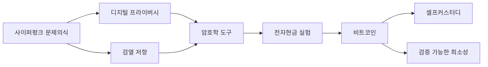

> [!info] 빠른 연결
> 허브: [[01_통화철학/index]]
> 먼저 읽기: [[01_통화철학/비트코인이란 무엇인가]]
> 함께 보기: [[07_프라이버시와_실사용/프라이버시모델]] · [[10_인물/아담 백]] · [[10_인물/할 피니]]

비트코인은 경제학만의 산물이 아니다. 그것은 [[10_인물/아담 백]], [[10_인물/닉 재보]], [[10_인물/할 피니]] 같은 인물들이 밀고 온 사이퍼펑크 전통, 즉 **프라이버시를 말로 설득하기보다 코드로 구현하려는 태도**에서 탄생했다. 사이퍼펑크들은 국가를 즉시 폐지하는 혁명가라기보다, 권력이 모든 통신과 거래를 들여다보는 비용을 낮추는 시대에 개인의 자율성을 지키려면 암호학적 도구가 필요하다고 본 엔지니어였다.

따라서 비트코인은 “정부에 맞서는 돈”이기 전에, **신뢰를 재배치하는 소프트웨어**다. 누구를 믿을 것인가가 아니라 어느 규칙을 검증할 것인가의 문제로 사회적 협력을 옮긴다. 이 관점에서 보면 [[02_프로토콜/노드와합의]]는 단순 기술 파트가 아니라 사이퍼펑크 정치철학의 구현 층이다.

## 사이퍼펑크에서 비트코인으로

## 핵심 직관

사이퍼펑크 전통의 핵심은 “좋은 사회를 위한 좋은 말”이 아니라 “권력의 정보 독점을 어렵게 만드는 도구”였다. 공개키 암호, 해시 함수, 디지털 서명은 사적인 통신을 위한 기술 같지만, 실은 협력 규칙을 중앙 중개자 없이 배치하는 토대이기도 하다. 비트코인은 그 토대 위에서 전자현금 문제를 다시 푼다.

이 맥락 때문에 많은 비트코이너는 거래소 계정 잔고를 비트코인 보유와 동일시하지 않는다. 사이퍼펑크적 의미의 소유는 법적 청구권이 아니라 **개인 키와 검증 능력**의 결합이기 때문이다. “Not your keys, not your coins”는 슬로건이기 전에 철학적 정의다.

## 사이퍼펑크와 맥시멀리즘의 관계

모든 사이퍼펑크가 비트코인 맥시멀리스트인 것은 아니다. 그러나 비트코인 맥시멀리즘은 사이퍼펑크 문제의식을 강하게 상속한다. 검열저항성과 무허가성은 네트워크 효과와 유동성이 하나의 자산으로 집중될수록 강해질 가능성이 크기 때문이다. 그래서 맥시들은 “수많은 체인이 경쟁하면 혁신이 생긴다”는 주장보다, **돈의 레이어는 하나의 공통 기준 위에서 압축될수록 사회적 마찰이 줄어든다**는 쪽을 더 높게 평가한다.

## 오해를 바로잡기

사이퍼펑크는 범죄 은닉을 위한 운동이 아니다. 프라이버시는 인간의 기본 협상 능력과 정치적 자유를 지키는 조건이라는 인식이 출발점이다. 프라이버시가 없는 사회에서 반대 의견, 소수자 권리, 재산권, 종교의 자유는 모두 손상된다. 비트코인의 프라이버시 기술과 [[07_프라이버시와_실사용/KYC와주소재사용과코인컨트롤]] 문서는 이런 배경에서 읽어야 정확하다.

## 참고 문헌과 원전

- Eric Hughes, 「A Cypherpunk’s Manifesto」.
- Tim May, crypto anarchy와 디지털 자유에 관한 글들.
- Satoshi Nakamoto Institute, 초기 전자현금/사이퍼펑크 문헌 아카이브.

## 보충 해설

통화철학 문서는 가격 전망이나 투자 언어와는 다르게 읽어야 한다. 여기서 중요한 것은 '비트코인이 오를까'가 아니라, 어떤 돈이 장기 저축을 가능하게 하고 어떤 제도가 시간선호를 뒤틀어 놓는가다. 그래서 이 폴더의 글들은 기술 문서의 전제이자, 실사용 문서의 의미를 정당화하는 배경으로 읽을 때 가장 힘을 얻는다.

또한 철학 문서라고 해서 현실에서 멀리 있는 것도 아니다. 화폐의 성질, 저축의 윤리, 검열 저항, 자발적 질서 같은 말은 모두 사용자의 행동 규칙으로 내려온다. 노드를 돌릴지, 수탁 대신 셀프커스터디를 택할지, 레이어드된 신용 구조를 어떻게 경계할지 같은 실천은 결국 이 폴더의 어휘로 다시 설명된다.

## 왜 사이퍼펑크가 여전히 핵심 전통인가
사이퍼펑크의 독특한 점은 정치적 목표를 법안이나 캠페인보다 프로토콜 설계로 번역하려 했다는 데 있다. 사적인 통신, 검열 저항, 익명성, 개인 주권 같은 가치를 지키려면, 권력자에게 선의를 기대하기보다 암호학과 분산 시스템으로 우회하자는 태도다. 비트코인은 이 전통이 화폐 영역에서 가장 강하게 구현된 사례로 읽을 수 있다.

이 문서를 읽을 때는 사이퍼펑크를 막연한 자유주의 정서로 축소하지 않는 편이 좋다. 여기에는 해시캐시, 전자현금 실험, 공개키 암호, 디지털 서명, 익명 리메일러 같은 구체적 도구의 역사가 있다. 또한 이 전통은 완벽한 익명성을 약속하기보다, 권력의 개입 비용을 높이고 사용자가 선택권을 가질 수 있게 하는 실용주의와도 맞닿아 있다. 비트코인의 보수성과 프라이버시 문화는 이런 배경 없이 이해하기 어렵다.

## 연결해서 읽기

이 문서는 [[01_통화철학/index]] · [[01_통화철학/비트코인이란 무엇인가]] · [[07_프라이버시와_실사용/프라이버시모델]]와 함께 읽을 때 입체감이 커진다. [[01_통화철학/index]] 문서는 철학적 전제 층위를 보강한다 / [[01_통화철학/비트코인이란 무엇인가]] 문서는 철학적 전제 층위를 보강한다 / [[07_프라이버시와_실사용/프라이버시모델]] 문서는 실사용과 메타데이터 방어 층위를 보강한다. 한 문서를 읽고 바로 이웃 문서로 건너가는 식으로 그래프를 타면, 같은 개념이 철학·기술·운영·역사 중 어느 층에서 다시 등장하는지 빠르게 감이 잡힌다.

특히 사이퍼펑크 같은 문서는 단독 정의보다 연결 속에서 의미가 커진다. 비트코인 지식은 선형 교재보다 네트워크 구조에 가깝기 때문에, 인접 노드 한두 개만 함께 읽어도 오해가 크게 줄어드는 경우가 많다.

## 스스로 점검할 질문

이 문서를 읽고 나면 적어도 세 가지 질문에는 자기 언어로 답해 볼 수 있어야 한다. 이 문장이 어떤 행동 규칙으로 내려오는가, 저축과 검증의 관계는 무엇인가, 국가·시장·기술의 경계는 어디에 놓이는가. 이 질문에 막히는 부분이 있다면 아직 개념 하나가 덜 붙은 것이므로, 바로 옆 문서와 함께 다시 읽는 편이 좋다.

## 보충 메모

'사이퍼펑크' 문서는 이 위키에서 돈과 저축의 철학 축을 지탱하는 노드다. 그래서 핵심 정의만 이해하는 것으로는 충분하지 않고, 그 정의가 다른 문서에서 어떻게 다시 쓰이는지까지 보는 편이 좋다. 비트코인 공부가 어려운 이유는 개념 수가 많아서가 아니라, 같은 개념이 여러 층에서 다른 역할을 맡기 때문이다.

독자가 지금 당장 모든 세부를 기억할 필요는 없다. 다만 이 문서의 문제의식이 왜 [[index]]로 돌아가 다른 갈래와 연결되는지, 그리고 왜 이 문서를 읽은 뒤 다시 실전 문서나 역사 문서로 건너가야 하는지만 분명히 붙잡으면 된다. 그런 식으로 왕복 독서를 할수록 지식은 목록이 아니라 구조가 된다.
