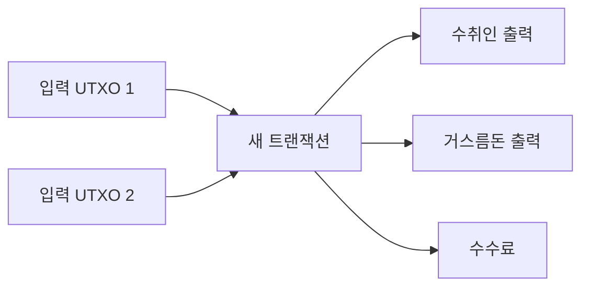

> [!info] 빠른 연결
> 허브: [[02_프로토콜/index]]
> 먼저 읽기: [[02_프로토콜/트랜잭션과서명]]
> 함께 보기: [[07_프라이버시와_실사용/KYC와주소재사용과코인컨트롤]] · [[04_보관과_운영/개인지갑사용가이드]]

UTXO는 Unspent Transaction Output의 약자다. 직역하면 “아직 쓰이지 않은 트랜잭션 출력”인데, 실제로는 비트코인의 소유권 조각을 표현하는 기본 단위다. 계좌 잔액 모델에서는 사용자가 하나의 숫자를 들고 있는 것처럼 보이지만, UTXO 모델에서는 여러 조각의 동전이 지갑 안에 흩어져 있고, 지출할 때 그 조각들을 골라 새로운 조각으로 다시 나누는 방식에 가깝다.

이 모델은 처음엔 불편해 보이지만, 검증과 프라이버시, 병렬성, 스크립트 조건의 명시성 측면에서 큰 장점을 준다. 또한 [[07_프라이버시와_실사용/KYC와주소재사용과코인컨트롤]]이 중요한 이유도 UTXO 모델 위에서 선명해진다. 어떤 조각을 함께 쓰는지가 곧 체인 분석의 단서가 되기 때문이다.

## UTXO의 생성과 소멸

## 계좌 모델과의 차이

계좌 모델에서는 “내 잔고 1 BTC”처럼 생각하면 되지만, 비트코인에서는 실제로 여러 UTXO가 합쳐져 그 잔고를 구성한다. 예를 들어 0.1 BTC, 0.3 BTC, 0.7 BTC라는 세 UTXO를 가지고 있다면 0.5 BTC를 보낼 때 어떤 조각을 쓸지 지갑이 선택해야 한다. 이 선택은 수수료, 프라이버시, 장래의 UTXO 파편화에 영향을 준다.

그래서 고급 사용자는 coin control 기능을 중시한다. 어떤 UTXO가 거래소 출금분인지, 어떤 UTXO가 개인 대면거래에서 받은 것인지, 어떤 UTXO가 장기 보관 금고용인지에 따라 섞는 방식이 달라져야 하기 때문이다.

## UTXO 세트는 왜 중요한가

풀노드가 반드시 기억해야 하는 것은 전체 역사 그 자체보다 현재 유효한 UTXO 세트다. 역사 전체를 재검증해 이 세트를 만들 수 있으면, 현재 들어오는 새 트랜잭션이 유효한지 확인할 수 있다. 따라서 UTXO 세트는 비트코인의 현재 상태를 압축한 그림이다. 이 세트의 크기, 접근 속도, 관리 비용은 노드 운영의 현실적인 부담과 직결된다.

## UTXO와 프라이버시

UTXO는 프라이버시의 친구이자 적이다. 잘 관리하면 목적별 분리와 coin control 덕분에 정보 누출을 줄일 수 있다. 반대로 무심코 여러 UTXO를 합쳐 쓰면, 서로 다른 출처가 같은 주체에게 귀속된다는 강한 신호를 체인 분석자에게 주게 된다. 비트코인의 프라이버시는 “기본적으로 익명”이 아니라 **행동에 따라 달라지는 가명성**이라는 표현이 더 정확하다.

## 참고 문헌과 원전

- Bitcoin developer documentation, transaction and UTXO model.
- Learn Me A Bitcoin, UTXO explanations.

## 보충 해설

프로토콜 문서는 기능 설명서처럼 보이지만 실제로는 적대적 환경에서 어떤 불변량을 지켜 내는지 설명하는 문서다. 비트코인의 규칙은 편의성을 극대화하려고 설계된 것이 아니라, 누구나 검증하고 누구도 쉽게 바꾸지 못하게 하려는 목적 아래 최소주의적으로 쌓여 왔다. 그래서 각 요소를 읽을 때는 '왜 이렇게 불편한가'보다 '어떤 공격면을 줄이려는가'를 먼저 떠올리는 편이 낫다.

이 폴더의 또 다른 핵심은 층위를 섞지 않는 것이다. 합의 규칙, 릴레이 정책, 지갑 UX, 서비스 사업자의 편의는 서로 다른 문제다. 이것들이 섞이면 블록 크기, 수수료, 검열, 주소 형식 같은 논쟁이 금세 혼탁해진다. 프로토콜 이해는 세부 기능을 외우는 것보다, 어떤 변화가 어느 층을 건드리는지 구분하는 훈련에 가깝다.

## UTXO 모델이 사고방식을 바꾸는 이유
UTXO는 잔고를 계정 숫자로 저장하는 대신, 아직 쓰이지 않은 출력들의 집합으로 가치를 표현한다. 이 구조는 처음에는 불편해 보이지만, 검증의 단순성과 병렬성, 프라이버시 전략, 코인 선택, 서명 범위 설계에 깊게 영향을 준다. 사용자는 사실 하나의 통장 잔고를 쓰는 것이 아니라, 여러 조각의 현금 묶음을 조합해 지불하는 셈이다.

이 사고방식이 중요한 이유는 실사용에서 바로 드러난다. 어떤 UTXO를 함께 쓰느냐는 주소 클러스터링과 프라이버시에 영향을 주고, 잔돈 출력은 이후의 추적 가능성과 수수료 부담에 흔적을 남긴다. 따라서 UTXO를 이해한다는 것은 프로토콜 개념을 이해하는 데 그치지 않고, 지갑 UX와 프라이버시 전략, 장기 보유 자금의 분리 운영까지 함께 이해하는 일이다.

## 연결해서 읽기

이 문서는 [[02_프로토콜/index]] · [[02_프로토콜/트랜잭션과서명]] · [[07_프라이버시와_실사용/KYC와주소재사용과코인컨트롤]]와 함께 읽을 때 입체감이 커진다. [[02_프로토콜/index]] 문서는 규칙과 검증 구조 층위를 보강한다 / [[02_프로토콜/트랜잭션과서명]] 문서는 규칙과 검증 구조 층위를 보강한다 / [[07_프라이버시와_실사용/KYC와주소재사용과코인컨트롤]] 문서는 실사용과 메타데이터 방어 층위를 보강한다. 한 문서를 읽고 바로 이웃 문서로 건너가는 식으로 그래프를 타면, 같은 개념이 철학·기술·운영·역사 중 어느 층에서 다시 등장하는지 빠르게 감이 잡힌다.

특히 UTXO 같은 문서는 단독 정의보다 연결 속에서 의미가 커진다. 비트코인 지식은 선형 교재보다 네트워크 구조에 가깝기 때문에, 인접 노드 한두 개만 함께 읽어도 오해가 크게 줄어드는 경우가 많다.

## 스스로 점검할 질문

이 문서를 읽고 나면 적어도 세 가지 질문에는 자기 언어로 답해 볼 수 있어야 한다. 어떤 불변량을 지키는 규칙인가, 이 규칙은 어느 층에서 집행되는가, 편의성과 검열저항의 trade-off는 어디에서 생기는가. 이 질문에 막히는 부분이 있다면 아직 개념 하나가 덜 붙은 것이므로, 바로 옆 문서와 함께 다시 읽는 편이 좋다.
