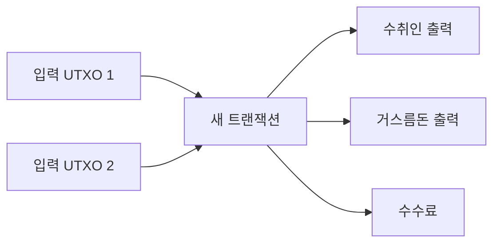

> [!info] 빠른 연결
> 허브: [[02_프로토콜/index]]
> 먼저 읽기: [[02_프로토콜/트랜잭션과서명]]
> 함께 보기: [[07_프라이버시와_실사용/KYC와주소재사용과코인컨트롤]] · [[04_보관과_운영/개인지갑사용가이드]]

UTXO는 Unspent Transaction Output의 약자다. 직역하면 “아직 쓰이지 않은 트랜잭션 출력”인데, 실제로는 비트코인의 소유권 조각을 표현하는 기본 단위다. 계좌 잔액 모델에서는 사용자가 하나의 숫자를 들고 있는 것처럼 보이지만, UTXO 모델에서는 여러 조각의 동전이 지갑 안에 흩어져 있고, 지출할 때 그 조각들을 골라 새로운 조각으로 다시 나누는 방식에 가깝다.

이 모델은 처음엔 불편해 보이지만, 검증과 프라이버시, 병렬성, 스크립트 조건의 명시성 측면에서 큰 장점을 준다. 또한 [[07_프라이버시와_실사용/KYC와주소재사용과코인컨트롤]]이 중요한 이유도 UTXO 모델 위에서 선명해진다. 어떤 조각을 함께 쓰는지가 곧 체인 분석의 단서가 되기 때문이다.

## UTXO의 생성과 소멸

## 계좌 모델과의 차이

계좌 모델에서는 “내 잔고 1 BTC”처럼 생각하면 되지만, 비트코인에서는 실제로 여러 UTXO가 합쳐져 그 잔고를 구성한다. 예를 들어 0.1 BTC, 0.3 BTC, 0.7 BTC라는 세 UTXO를 가지고 있다면 0.5 BTC를 보낼 때 어떤 조각을 쓸지 지갑이 선택해야 한다. 이 선택은 수수료, 프라이버시, 장래의 UTXO 파편화에 영향을 준다.

그래서 고급 사용자는 coin control 기능을 중시한다. 어떤 UTXO가 거래소 출금분인지, 어떤 UTXO가 개인 대면거래에서 받은 것인지, 어떤 UTXO가 장기 보관 금고용인지에 따라 섞는 방식이 달라져야 하기 때문이다.

## UTXO 세트는 왜 중요한가

풀노드가 반드시 기억해야 하는 것은 전체 역사 그 자체보다 현재 유효한 UTXO 세트다. 역사 전체를 재검증해 이 세트를 만들 수 있으면, 현재 들어오는 새 트랜잭션이 유효한지 확인할 수 있다. 따라서 UTXO 세트는 비트코인의 현재 상태를 압축한 그림이다. 이 세트의 크기, 접근 속도, 관리 비용은 노드 운영의 현실적인 부담과 직결된다.

## UTXO와 프라이버시

UTXO는 프라이버시의 친구이자 적이다. 잘 관리하면 목적별 분리와 coin control 덕분에 정보 누출을 줄일 수 있다. 반대로 무심코 여러 UTXO를 합쳐 쓰면, 서로 다른 출처가 같은 주체에게 귀속된다는 강한 신호를 체인 분석자에게 주게 된다. 비트코인의 프라이버시는 “기본적으로 익명”이 아니라 **행동에 따라 달라지는 가명성**이라는 표현이 더 정확하다.

## 공식 문서 기준 핵심 사실

비트코인 공식 문서 기준으로 UTXO는 “아직 소비되지 않은 출력”이며, 지갑 잔고는 이런 출력들의 합으로 표현된다.

- [[https://developer.bitcoin.org/devguide/transactions.html|Bitcoin Developer Guide - Transactions]]는 각 입력이 이전 출력 하나를 소비하고, 각 출력은 이후 다른 입력이 소비할 때까지 UTXO로 남는다고 설명한다.
- [[https://bitcoin.org/bitcoin.pdf|비트코인 백서]] 9장은 가치가 입력과 출력의 결합·분할로 이동한다고 설명한다. 즉 계좌 잔고를 수정하는 방식이 아니라, 기존 출력들을 새 출력으로 교체하는 방식이다.
- 트랜잭션 수수료는 별도 칸이 아니라 입력 총합과 출력 총합의 차이로 계산된다. 그래서 지갑은 대부분 지불 출력 외에 거스름돈 출력도 함께 만든다.
- 풀노드가 새 트랜잭션을 검증할 때 직접 필요한 현재 상태는 “이 출력이 아직 미사용인가”라는 UTXO 집합이다. 과거 블록 전체를 다시 읽어 이 집합을 재구성할 수 있어야 검증 주권이 생긴다.

## 실전에서 꼭 기억할 것

- 잔고는 숫자 하나가 아니라 여러 UTXO 묶음이다. 0.5 BTC를 보내도 1 BTC UTXO가 반으로 잘려 남는 것이 아니라, 기존 UTXO가 사라지고 새 수취 출력과 새 거스름돈 출력이 생긴다.
- 어떤 UTXO를 함께 쓰는지는 프라이버시 사건이다. 서로 다른 출처의 UTXO를 한 트랜잭션에 같이 넣으면 같은 주체가 통제한다는 강한 신호가 생긴다.
- 장기보관용, 실사용용, 거래소 출금분을 같은 지갑 안에서라도 별도 UTXO 묶음처럼 관리해야 나중에 코인 컨트롤이 가능하다.

## 참고 문헌과 원전

- [[https://developer.bitcoin.org/devguide/transactions.html|Bitcoin Developer Guide - Transactions]]
- [[https://bitcoin.org/bitcoin.pdf|비트코인 백서]]
- [[02_프로토콜/트랜잭션과서명]]
- [[07_프라이버시와_실사용/KYC와주소재사용과코인컨트롤]]

## 스스로 점검할 질문

- 내 지갑의 “잔고”가 실제로는 여러 UTXO의 합이라는 점을 설명할 수 있는가
- 왜 change output이 새 주소로 생성되는지, 그게 프라이버시와 어떤 관계가 있는지 설명할 수 있는가
- 풀노드가 현재 상태를 검증할 때 왜 UTXO 집합이 핵심인지 설명할 수 있는가
