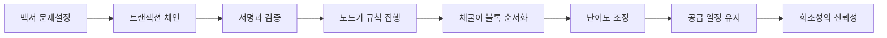

> [!info] 빠른 연결
> 허브: [[index]]

이 폴더는 비트코인을 “가격표가 붙은 자산”이 아니라 **검증 규칙의 집합**으로 읽기 위한 중심 허브다. 여기서 중요한 것은 모든 디테일을 외우는 일이 아니라, 어느 요소가 어느 위험을 막는지 연결해서 이해하는 것이다. UTXO는 왜 회계 단위가 아니라 소유권 조각의 집합처럼 보이는지, 멤풀은 왜 단순 대기열이 아니라 수수료 시장의 예고편인지, 합의는 왜 다수결이 아니라 각자가 규칙을 강제하는 구조인지가 핵심이다.

## 백서에서 운영까지의 흐름

## 문서 지도

| 문서 | 초점 |
|---|---|
| [[02_프로토콜/백서개관]] | 백서 전체 구조와 각 장의 의미 |
| [[02_프로토콜/UTXO]] | 비트코인의 회계 모델 |
| [[02_프로토콜/트랜잭션과서명]] | 입출력, 서명, 변경주소, fee |
| [[02_프로토콜/주소와출력스크립트]] | 주소는 계정이 아니라 지불 조건의 인코딩이라는 점 |
| [[02_프로토콜/스크립트와검증]] | Script, witness, 정책과 합의의 구분 |
| [[02_프로토콜/합의와정책]] | valid, standard, wallet default의 차이 |
| [[02_프로토콜/노드와합의]] | 풀노드, 합의, longest chain의 오해 |
| [[02_프로토콜/블록헤더와체인워크]] | 체인 선택, 난이도, 재구성 비용 |
| [[02_프로토콜/멤풀과수수료시장]] | 수수료 시장, RBF, CPFP, congestion |
| [[02_프로토콜/P2P네트워크와전파]] | 전파, compact relay, 핑퐁 없이 확산되는 방식 |
| [[02_프로토콜/SPV와경량검증]] | 경량검증과 풀노드 검증의 차이 |
| [[02_프로토콜/블록공간과검열저항]] | scarce blockspace와 사회적 의미 |

## 보충 해설

프로토콜 문서는 기능 설명서처럼 보이지만 실제로는 적대적 환경에서 어떤 불변량을 지켜 내는지 설명하는 문서다. 비트코인의 규칙은 편의성을 극대화하려고 설계된 것이 아니라, 누구나 검증하고 누구도 쉽게 바꾸지 못하게 하려는 목적 아래 최소주의적으로 쌓여 왔다. 그래서 각 요소를 읽을 때는 '왜 이렇게 불편한가'보다 '어떤 공격면을 줄이려는가'를 먼저 떠올리는 편이 낫다.

이 폴더의 또 다른 핵심은 층위를 섞지 않는 것이다. 합의 규칙, 릴레이 정책, 지갑 UX, 서비스 사업자의 편의는 서로 다른 문제다. 이것들이 섞이면 블록 크기, 수수료, 검열, 주소 형식 같은 논쟁이 금세 혼탁해진다. 프로토콜 이해는 세부 기능을 외우는 것보다, 어떤 변화가 어느 층을 건드리는지 구분하는 훈련에 가깝다.

## 프로토콜 폴더의 독해법
비트코인 프로토콜을 배울 때는 각 문서를 고립된 기술 설명으로 읽지 않는 편이 좋다. 주소, 트랜잭션, UTXO, 멤풀, 블록헤더, 체인워크 같은 요소는 서로 얽혀 하나의 검증 파이프라인을 만든다. 예컨대 사용자가 서명한 트랜잭션은 네트워크를 통해 전파되고, 노드는 정책 기준으로 일시 보관하며, 채굴자는 블록에 포함시키고, 결국 각 노드는 합의 규칙에 따라 그 블록을 인정하거나 거부한다. 어느 한 고리만 따로 이해하면 전체 작동 원리가 반쯤 가려진다.

이 허브의 진짜 가치는 '왜 비트코인이 믿음보다 검증을 강조하는가'를 기술 언어로 보여 준다는 데 있다. 통화철학 문서가 규칙의 정당성을 말한다면, 이 폴더는 그 규칙이 어떻게 집행되는지 보여 준다. 그래서 프로토콜 문서는 투자론의 배경지식이 아니라, 비트코인이라는 시스템이 무엇을 불변 규범으로 삼는지 드러내는 설계도다.

## 연결해서 읽기

이 문서는 [[index]] · [[02_프로토콜/백서개관]] · [[02_프로토콜/UTXO]]와 함께 읽을 때 입체감이 커진다. [[index]] 문서는 전체 허브 층위를 보강한다 / [[02_프로토콜/백서개관]] 문서는 규칙과 검증 구조 층위를 보강한다 / [[02_프로토콜/UTXO]] 문서는 규칙과 검증 구조 층위를 보강한다. 한 문서를 읽고 바로 이웃 문서로 건너가는 식으로 그래프를 타면, 같은 개념이 철학·기술·운영·역사 중 어느 층에서 다시 등장하는지 빠르게 감이 잡힌다.

특히 프로토콜 같은 문서는 단독 정의보다 연결 속에서 의미가 커진다. 비트코인 지식은 선형 교재보다 네트워크 구조에 가깝기 때문에, 인접 노드 한두 개만 함께 읽어도 오해가 크게 줄어드는 경우가 많다.

## 스스로 점검할 질문

이 문서를 읽고 나면 적어도 세 가지 질문에는 자기 언어로 답해 볼 수 있어야 한다. 어떤 불변량을 지키는 규칙인가, 이 규칙은 어느 층에서 집행되는가, 편의성과 검열저항의 trade-off는 어디에서 생기는가. 이 질문에 막히는 부분이 있다면 아직 개념 하나가 덜 붙은 것이므로, 바로 옆 문서와 함께 다시 읽는 편이 좋다.
