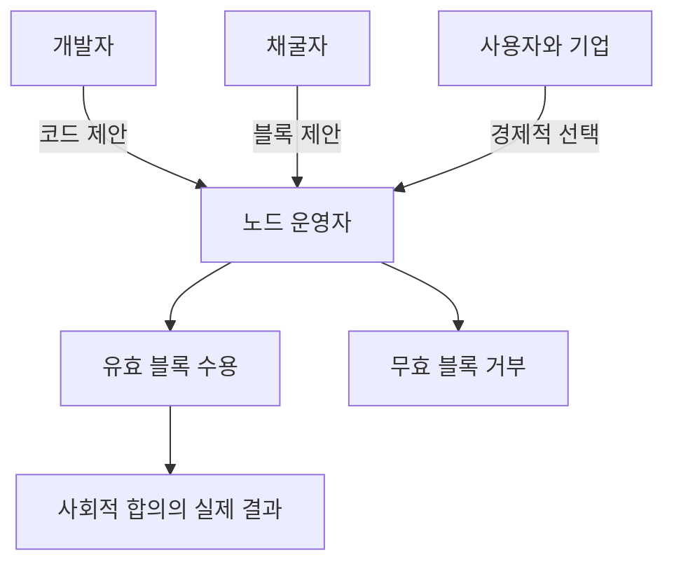

> [!info] 빠른 연결
> 허브: [[02_프로토콜/index]]
> 먼저 읽기: [[02_프로토콜/백서개관]]
> 함께 보기: [[04_보관과_운영/풀노드운영가이드]] · [[08_역사와_논쟁/블록사이즈워]]

비트코인 합의를 다수결 투표로 이해하면 거의 모든 것을 오해하게 된다. 비트코인에서 합의는 “누가 지휘하느냐”가 아니라 “각자가 어떤 블록만 유효하다고 인정하느냐”의 문제다. 풀노드는 받은 블록과 트랜잭션이 규칙을 만족하는지 독립적으로 검증하고, 만족하지 않으면 누구에게서 왔든 거부한다. 그래서 합의는 민주적 여론이 아니라 **분산된 거부권의 교집합**에 가깝다.

채굴자는 블록 순서를 제안하지만 규칙을 정의하지는 못한다. 개발자는 코드를 쓰지만 네트워크에 강제할 수는 없다. 거래소와 기관은 유동성을 가지지만 합의 규칙의 주인은 아니다. 이 삼각 구도를 이해해야만 [[08_역사와_논쟁/블록사이즈워]]와 여러 soft fork 과정을 제대로 읽을 수 있다.

## 누가 무엇을 하는가

## Longest chain의 흔한 오해

비트코인은 가장 긴 체인을 무조건 따르지 않는다. 더 정확히 말하면 **가장 많은 누적 작업량을 가진 유효한 체인**을 따른다. 유효성이 먼저이고 길이는 그 다음이다. 채굴자가 공급 규칙을 어기거나 스크립트 검증을 무시한 긴 체인을 내놓아도, 노드는 그것을 체인으로 인정하지 않는다.

## 합의의 보수성과 사회성

합의는 기술 규칙이지만 동시에 사회적이다. 무엇을 변경 가능한 규칙으로 보고, 무엇을 절대 변경 불가능한 규범으로 취급하는지는 인간 공동체의 문화가 정한다. 비트코인의 강점은 이 문화가 매우 보수적으로 형성되어 있다는 점이다. 특히 공급 상한과 셀프커스터디 가능성에 대해서는 거의 헌법적 수준의 금기와 방어 본능이 존재한다.

## 풀노드의 의미

풀노드를 돌리는 이유는 단순 애국심이 아니다. 풀노드는 거래소, 지갑 서버, 블록 탐색기, 소셜 미디어의 해석을 믿지 않고 스스로 자산 상태를 검증하기 위한 장비다. 이는 사이퍼펑크적 자율성의 핵심이면서, 동시에 거버넌스에서 개인이 실제 발언권을 갖는 방식이다. 노드를 돌리지 않는 사용자도 비트코인을 쓸 수는 있지만, 규칙의 최종 심판은 결국 자기 바깥에 두게 된다.

## 참고 문헌과 원전

- Bitcoin Core full node guidance.
- Blocksize War history and user-activated soft fork documentation.
- Satoshi emails/posts on nodes and validation.

## 보충 해설

프로토콜 문서는 기능 설명서처럼 보이지만 실제로는 적대적 환경에서 어떤 불변량을 지켜 내는지 설명하는 문서다. 비트코인의 규칙은 편의성을 극대화하려고 설계된 것이 아니라, 누구나 검증하고 누구도 쉽게 바꾸지 못하게 하려는 목적 아래 최소주의적으로 쌓여 왔다. 그래서 각 요소를 읽을 때는 '왜 이렇게 불편한가'보다 '어떤 공격면을 줄이려는가'를 먼저 떠올리는 편이 낫다.

이 폴더의 또 다른 핵심은 층위를 섞지 않는 것이다. 합의 규칙, 릴레이 정책, 지갑 UX, 서비스 사업자의 편의는 서로 다른 문제다. 이것들이 섞이면 블록 크기, 수수료, 검열, 주소 형식 같은 논쟁이 금세 혼탁해진다. 프로토콜 이해는 세부 기능을 외우는 것보다, 어떤 변화가 어느 층을 건드리는지 구분하는 훈련에 가깝다.

## 합의는 코드이면서 문화다
노드는 블록과 트랜잭션을 검증하는 소프트웨어이지만, 그들이 집행하는 규칙은 결국 인간 공동체가 어떤 것을 정당한 비트코인으로 인정할지에 대한 문화와 맞닿아 있다. 합의란 만장일치의 취향이 아니라, 서로 독립된 참가자들이 동일한 규칙 집합을 유지할 때만 같은 자산을 본다는 사실이다. 이 때문에 비트코인의 합의는 시장 가격보다 느리고, 유행보다 보수적이다.

이 문서에서 중요한 포인트는 채굴자, 개발자, 지갑 사업자, 거래소가 모두 중요해 보여도 최종적으로 규칙을 받아들이는 것은 노드 운영자와 시장 참여자라는 점이다. 바로 여기서 비트코인의 권력 구조가 전통적 금융 시스템과 갈라진다. 중앙 관리자가 정책을 선포하는 대신, 각자가 같은 규칙을 돌리며 호환성을 유지하는 것이 핵심이다.

## 연결해서 읽기

이 문서는 [[02_프로토콜/index]] · [[02_프로토콜/백서개관]] · [[04_보관과_운영/풀노드운영가이드]]와 함께 읽을 때 입체감이 커진다. [[02_프로토콜/index]] 문서는 규칙과 검증 구조 층위를 보강한다 / [[02_프로토콜/백서개관]] 문서는 규칙과 검증 구조 층위를 보강한다 / [[04_보관과_운영/풀노드운영가이드]] 문서는 셀프커스터디 실무 층위를 보강한다. 한 문서를 읽고 바로 이웃 문서로 건너가는 식으로 그래프를 타면, 같은 개념이 철학·기술·운영·역사 중 어느 층에서 다시 등장하는지 빠르게 감이 잡힌다.

특히 노드와 합의 같은 문서는 단독 정의보다 연결 속에서 의미가 커진다. 비트코인 지식은 선형 교재보다 네트워크 구조에 가깝기 때문에, 인접 노드 한두 개만 함께 읽어도 오해가 크게 줄어드는 경우가 많다.

## 스스로 점검할 질문

이 문서를 읽고 나면 적어도 세 가지 질문에는 자기 언어로 답해 볼 수 있어야 한다. 어떤 불변량을 지키는 규칙인가, 이 규칙은 어느 층에서 집행되는가, 편의성과 검열저항의 trade-off는 어디에서 생기는가. 이 질문에 막히는 부분이 있다면 아직 개념 하나가 덜 붙은 것이므로, 바로 옆 문서와 함께 다시 읽는 편이 좋다.
