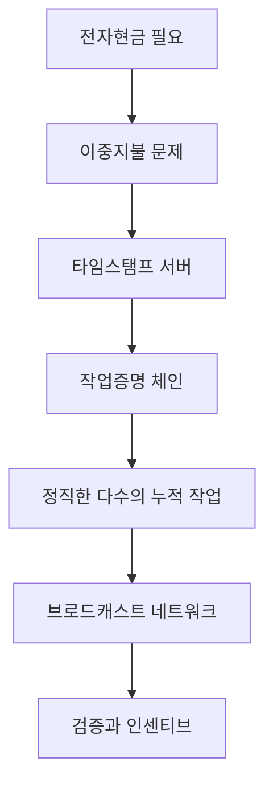

> [!info] 빠른 연결
> 허브: [[02_프로토콜/index]]
> 함께 보기: [[09_도서와_자료/필레몬·바우키스의비트코인백서해설]] · [[02_프로토콜/노드와합의]] · [[05_채굴과_인프라/채굴과난이도조정]]

사토시의 백서는 분량이 짧지만, 사실상 “중개기관 없는 전자현금”을 가능하게 하는 최소 설계 도면이다. 문체는 놀랄 만큼 건조하고 절제돼 있다. 그 건조함 덕분에 독자는 오히려 핵심 문제를 또렷하게 보게 된다. 이중지불은 어떻게 막는가, 순서 정하기를 누가 하는가, 계산 자원을 쏟아 붓는 비용은 어떻게 공격 억지력으로 전환되는가, 네트워크가 느슨하게 동작해도 전체 규칙은 어떻게 유지되는가가 백서의 줄기다.

백서를 잘 읽는 법은 각 문장을 현대 용어로 과잉 번역하지 않는 것이다. 동시에 당시의 제약도 잊지 않아야 한다. 백서는 Lightning, PSBT, descriptor, Taproot가 없던 시절의 원본 설계다. 따라서 오늘날의 실무는 백서보다 훨씬 두껍지만, 핵심 철학은 여전히 백서에 남아 있다. [[09_도서와_자료/필레몬·바우키스의비트코인백서해설]]은 이 압축을 한국어로 매우 촘촘하게 풀어주는 안내서다.

## 백서의 논리 구조

## 백서의 각 장을 어떻게 읽을까

서론은 비트코인을 금융 상품으로 소개하지 않는다. 중개기관 모델이 가지는 거래 되돌림, 사기 비용, 개인정보 노출, 소액결제의 마찰을 문제로 설정한다. 이어지는 장에서는 거래를 서명된 체인으로 정의하고, 이를 시간순으로 묶어 두는 장치로 작업증명 기반 타임스탬프 서버를 제안한다. 이후 네트워크 장과 인센티브 장은 시스템이 “그럴듯하게”가 아니라 실제로 굴러가게 하는 요소를 설명한다.

백서 후반부는 저장 공간 회수, SPV, 결합과 분할, 프라이버시까지 다루는데, 여기서 이미 비트코인이 단순한 원장 아이디어가 아니라 **운영 비용을 줄이는 엔지니어링 선택들의 묶음**임이 드러난다. 현대 독자는 이 장들을 오늘의 구현과 대조해 읽어야 얻는 것이 많다.

## 백서가 말하지 않는 것

백서는 만능 참고서가 아니다. 스크립트 정책, UTXO 관리 UX, 수수료 estimation, 키 관리, multisig 운영, Lightning, 현대 프라이버시 기법 등은 백서 밖에서 크게 진화했다. 따라서 백서를 절대화하는 태도는 오히려 시스템의 실제 모습을 왜곡할 수 있다. 백서는 원점을 보여 주고, 이후의 BIP와 구현, 역사적 논쟁이 그 점을 어떻게 보강했는지를 읽어야 한다.

## 참고 문헌과 원전

- Satoshi Nakamoto, *Bitcoin: A Peer-to-Peer Electronic Cash System*.
- 필레몬·바우키스, 『비트코인 백서 해설』.

## 보충 해설

프로토콜 문서는 기능 설명서처럼 보이지만 실제로는 적대적 환경에서 어떤 불변량을 지켜 내는지 설명하는 문서다. 비트코인의 규칙은 편의성을 극대화하려고 설계된 것이 아니라, 누구나 검증하고 누구도 쉽게 바꾸지 못하게 하려는 목적 아래 최소주의적으로 쌓여 왔다. 그래서 각 요소를 읽을 때는 '왜 이렇게 불편한가'보다 '어떤 공격면을 줄이려는가'를 먼저 떠올리는 편이 낫다.

이 폴더의 또 다른 핵심은 층위를 섞지 않는 것이다. 합의 규칙, 릴레이 정책, 지갑 UX, 서비스 사업자의 편의는 서로 다른 문제다. 이것들이 섞이면 블록 크기, 수수료, 검열, 주소 형식 같은 논쟁이 금세 혼탁해진다. 프로토콜 이해는 세부 기능을 외우는 것보다, 어떤 변화가 어느 층을 건드리는지 구분하는 훈련에 가깝다.

## 백서를 목차 이상의 설계도로 읽기
비트코인 백서는 짧지만, 각 절이 이후의 수년간 어떤 개발 문화와 논쟁을 낳았는지까지 생각하며 읽으면 훨씬 깊어진다. 타임스탬프 서버, 작업증명, 네트워크, 인센티브, 저장 공간 회수, SPV, 프라이버시 같은 절은 서로 떨어진 아이디어 모음이 아니라 하나의 공격면 지도를 이룬다. 사토시는 기존 전자현금 문제들을 어떻게 분해했고, 그 해법을 어떻게 조립했는지를 목차 순서 자체가 보여 준다.

따라서 백서 개관은 단순 요약보다 '어떤 절이 현재 어떤 문서로 분화되었는가'를 추적할 때 의미가 커진다. 예컨대 SPV 절은 경량검증 논의로, 인센티브 절은 채굴 경제학과 수수료 시장 논의로, 프라이버시 절은 주소 재사용과 코인컨트롤 논의로 자란다. 백서를 현재의 위키 노드들로 번역해 보는 작업이 바로 이 문서의 핵심이다.

## 연결해서 읽기

이 문서는 [[02_프로토콜/index]] · [[09_도서와_자료/필레몬·바우키스의비트코인백서해설]] · [[02_프로토콜/노드와합의]]와 함께 읽을 때 입체감이 커진다. [[02_프로토콜/index]] 문서는 규칙과 검증 구조 층위를 보강한다 / [[09_도서와_자료/필레몬·바우키스의비트코인백서해설]] 문서는 원전과 학습 자료 층위를 보강한다 / [[02_프로토콜/노드와합의]] 문서는 규칙과 검증 구조 층위를 보강한다. 한 문서를 읽고 바로 이웃 문서로 건너가는 식으로 그래프를 타면, 같은 개념이 철학·기술·운영·역사 중 어느 층에서 다시 등장하는지 빠르게 감이 잡힌다.

특히 백서 개관 같은 문서는 단독 정의보다 연결 속에서 의미가 커진다. 비트코인 지식은 선형 교재보다 네트워크 구조에 가깝기 때문에, 인접 노드 한두 개만 함께 읽어도 오해가 크게 줄어드는 경우가 많다.

## 스스로 점검할 질문

이 문서를 읽고 나면 적어도 세 가지 질문에는 자기 언어로 답해 볼 수 있어야 한다. 어떤 불변량을 지키는 규칙인가, 이 규칙은 어느 층에서 집행되는가, 편의성과 검열저항의 trade-off는 어디에서 생기는가. 이 질문에 막히는 부분이 있다면 아직 개념 하나가 덜 붙은 것이므로, 바로 옆 문서와 함께 다시 읽는 편이 좋다.
