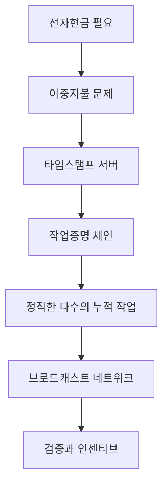

> [!info] 빠른 연결
> 허브: [[02_프로토콜/index]]
> 함께 보기: [[09_도서와_자료/필레몬·바우키스의비트코인백서해설]] · [[02_프로토콜/노드와합의]] · [[05_채굴과_인프라/채굴과난이도조정]]

사토시의 백서는 분량이 짧지만, 사실상 “중개기관 없는 전자현금”을 가능하게 하는 최소 설계 도면이다. 문체는 놀랄 만큼 건조하고 절제돼 있다. 그 건조함 덕분에 독자는 오히려 핵심 문제를 또렷하게 보게 된다. 이중지불은 어떻게 막는가, 순서 정하기를 누가 하는가, 계산 자원을 쏟아 붓는 비용은 어떻게 공격 억지력으로 전환되는가, 네트워크가 느슨하게 동작해도 전체 규칙은 어떻게 유지되는가가 백서의 줄기다.

백서를 잘 읽는 법은 각 문장을 현대 용어로 과잉 번역하지 않는 것이다. 동시에 당시의 제약도 잊지 않아야 한다. 백서는 Lightning, PSBT, descriptor, Taproot가 없던 시절의 원본 설계다. 따라서 오늘날의 실무는 백서보다 훨씬 두껍지만, 핵심 철학은 여전히 백서에 남아 있다. [[09_도서와_자료/필레몬·바우키스의비트코인백서해설]]은 이 압축을 한국어로 매우 촘촘하게 풀어주는 안내서다.

## 백서의 논리 구조

## 백서의 각 장을 어떻게 읽을까

서론은 비트코인을 금융 상품으로 소개하지 않는다. 중개기관 모델이 가지는 거래 되돌림, 사기 비용, 개인정보 노출, 소액결제의 마찰을 문제로 설정한다. 이어지는 장에서는 거래를 서명된 체인으로 정의하고, 이를 시간순으로 묶어 두는 장치로 작업증명 기반 타임스탬프 서버를 제안한다. 이후 네트워크 장과 인센티브 장은 시스템이 “그럴듯하게”가 아니라 실제로 굴러가게 하는 요소를 설명한다.

백서 후반부는 저장 공간 회수, SPV, 결합과 분할, 프라이버시까지 다루는데, 여기서 이미 비트코인이 단순한 원장 아이디어가 아니라 **운영 비용을 줄이는 엔지니어링 선택들의 묶음**임이 드러난다. 현대 독자는 이 장들을 오늘의 구현과 대조해 읽어야 얻는 것이 많다.

## 백서가 말하지 않는 것

백서는 만능 참고서가 아니다. 스크립트 정책, UTXO 관리 UX, 수수료 estimation, 키 관리, multisig 운영, Lightning, 현대 프라이버시 기법 등은 백서 밖에서 크게 진화했다. 따라서 백서를 절대화하는 태도는 오히려 시스템의 실제 모습을 왜곡할 수 있다. 백서는 원점을 보여 주고, 이후의 BIP와 구현, 역사적 논쟁이 그 점을 어떻게 보강했는지를 읽어야 한다.

## 공식 문서 기준 핵심 읽기 포인트

- [[https://bitcoin.org/bitcoin.pdf|비트코인 백서]] 서론은 문제를 “신뢰 기반 전자결제의 마찰”로 두고, 해법을 “cryptographic proof instead of trust”로 제시한다. 백서를 투자 논문이 아니라 결제 시스템 설계 문서로 먼저 읽어야 하는 이유다.
- 2장과 3장은 거래의 서명 체인과 타임스탬프 서버를 설명하고, 4장과 5장은 작업증명과 브로드캐스트 네트워크를 통해 단일 거래 순서를 정하는 구조를 설명한다.
- 6장과 8장은 인센티브와 SPV를 다뤄 “왜 노드가 정직하게 행동할 동기가 있는가”와 “전체 노드를 돌리지 않고도 어디까지 확인할 수 있는가”를 구분한다.
- 7장과 10장은 저장공간 회수, 결합과 분할을 설명한다. 오늘날의 UTXO, pruning, 경량검증 논의를 볼 때도 이 원점이 중요하다.

## 현대 독자가 보완해서 읽어야 할 지점

- 백서는 오늘의 전체 비트코인 설명서가 아니다. SegWit, Taproot, descriptor, Lightning, 현대 수수료 추정, 실사용 지갑 UX는 백서 이후 문서와 구현을 통해 크게 확장됐다.
- 그래서 백서의 각 장은 “완성된 답안”이 아니라 “문제가 처음 어떻게 정식화되었는가”를 보여 주는 원전으로 읽는 편이 정확하다.
- 입문자는 백서를 읽고 바로 현재 구현 문서로 넘어가야 한다. 백서만 붙잡으면 현재 운영 현실을 놓치고, 반대로 백서를 건너뛰면 왜 이런 불편을 감수하는지 철학적 축을 놓친다.

## 참고 문헌과 원전

- [[https://bitcoin.org/bitcoin.pdf|비트코인 백서]]
- [[09_도서와_자료/필레몬·바우키스의비트코인백서해설]]
- [[02_프로토콜/노드와합의]]
- [[02_프로토콜/SPV와경량검증]]

## 스스로 점검할 질문

- 백서가 해결하려는 원문 문제를 “가격”이 아니라 “신뢰 없는 결제” 관점에서 설명할 수 있는가
- 백서의 어느 장이 오늘의 어떤 구현 문서나 논쟁으로 이어졌는지 연결해 말할 수 있는가
- 백서에 없는 현대 요소가 무엇인지, 그래서 어떤 추가 문서를 읽어야 하는지 설명할 수 있는가
