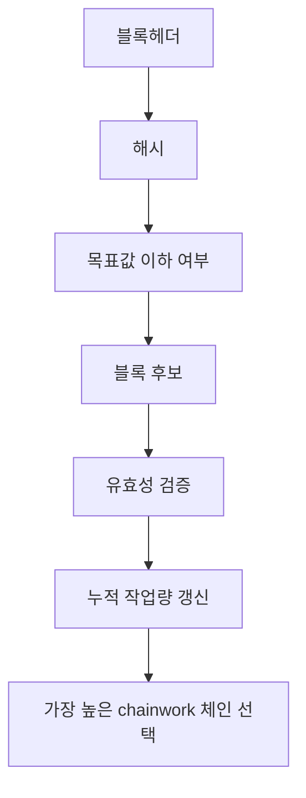

> [!info] 빠른 연결
> 허브: [[02_프로토콜/index]]
> 먼저 읽기: [[05_채굴과_인프라/채굴과난이도조정]]
> 함께 보기: [[02_프로토콜/노드와합의]] · [[05_채굴과_인프라/해시가격과채굴경제학]]

블록체인을 “블록들의 줄”로만 이해하면 중요한 것을 놓친다. 노드가 실제로 비교하는 것은 단순 블록 개수나 체인의 길이가 아니라, 각 체인이 축적한 **누적 작업량**, 즉 chainwork다. 그래서 “가장 긴 체인”이라는 표현은 교육용 축약어로는 편리하지만 엄밀하지 않다. 비트코인에서 더 정확한 표현은 “가장 많은 작업증명이 축적된 유효 체인”이다.

## 블록헤더는 무엇을 담는가

블록 전체는 트랜잭션 묶음과 부가 데이터를 담지만, 채굴이 직접 해싱하는 핵심 단위는 80바이트 블록헤더다. 여기에는 이전 블록 해시, 머클 루트, 타임스탬프, 난이도 목표를 표현하는 값, nonce 등이 들어간다. 이 값들의 조합이 해시 퍼즐의 입력이 되며, 유효한 목표값 이하의 해시를 찾으면 해당 후보 블록은 네트워크에 제시될 수 있다.

## 왜 chainwork가 중요한가

작업증명은 “누가 먼저 말했는가”가 아니라 “누가 더 많은 비용을 태웠는가”를 기록한다. 따라서 재구성을 시도하는 공격자는 단순히 블록 하나를 다시 쓰는 것이 아니라, 현재 체인의 누적 작업량을 따라잡아야 한다. 이것이 비트코인의 역사 수정 비용을 높이는 핵심 메커니즘이다. 블록 수가 같더라도 난이도와 누적 작업량이 다를 수 있으므로, 합의 구현에서는 chainwork 같은 지표가 필요하다.

## 최종성과 재구성

비트코인에는 절대적 finality 버튼이 없다. 대신 시간이 지날수록, 그리고 뒤에 더 많은 작업증명이 쌓일수록 이전 거래를 뒤엎는 비용이 커진다. 이 때문에 소액 결제와 고액 정산은 서로 다른 확인 수를 요구하는 것이 합리적이다. 사용자는 이 점을 이해해야 “1컨펌이면 끝난 거냐” 같은 질문을 더 정확하게 다룰 수 있다.

## 채굴과 헤더의 연결

채굴 장비는 사실상 헤더 공간을 샅샅이 뒤지는 기계다. nonce만이 아니라 시간 필드, 버전 비트, 코인베이스와 머클 루트 구성까지 검색 공간의 일부가 된다. 그래서 블록헤더를 이해하면 작업증명, Stratum, 템플릿 구성, 풀 중앙화 문제까지 한꺼번에 이어진다.

## 실무 감각

- “longest chain”은 교육용 표현이고, 구현 수준에서는 chainwork가 더 중요하다.
- 높은 chainwork를 가진 체인이라도 **유효하지 않으면** 당연히 채택되지 않는다. 유효성 검증이 먼저다.
- 컨펌 수는 신앙이 아니라 위험 관리다. 금액, 상대방, 재구성 가능성에 따라 달라져야 한다.

## 보충 해설

프로토콜 문서는 기능 설명서처럼 보이지만 실제로는 적대적 환경에서 어떤 불변량을 지켜 내는지 설명하는 문서다. 비트코인의 규칙은 편의성을 극대화하려고 설계된 것이 아니라, 누구나 검증하고 누구도 쉽게 바꾸지 못하게 하려는 목적 아래 최소주의적으로 쌓여 왔다. 그래서 각 요소를 읽을 때는 '왜 이렇게 불편한가'보다 '어떤 공격면을 줄이려는가'를 먼저 떠올리는 편이 낫다.

이 폴더의 또 다른 핵심은 층위를 섞지 않는 것이다. 합의 규칙, 릴레이 정책, 지갑 UX, 서비스 사업자의 편의는 서로 다른 문제다. 이것들이 섞이면 블록 크기, 수수료, 검열, 주소 형식 같은 논쟁이 금세 혼탁해진다. 프로토콜 이해는 세부 기능을 외우는 것보다, 어떤 변화가 어느 층을 건드리는지 구분하는 훈련에 가깝다.

## 왜 체인워크가 최종성의 감각을 만든가
블록헤더는 체인의 요약판 같지만, 사실 작업증명이 압축되어 기록되는 핵심 단위다. 해시, 이전 블록 참조, 머클루트, 난이도 목표, 논스 등이 들어 있는 이 작은 구조 안에 '이 체인을 뒤집으려면 얼마나 많은 현실 세계 비용이 드는가'라는 질문이 응축된다. 체인워크는 단순히 블록 수를 세는 것이 아니라, 누적된 작업량을 통해 어느 체인이 더 큰 경제적 비용을 지닌 기록인지 판단하게 해 준다.

이 감각이 중요한 이유는 비트코인의 최종성이 법적 선언이 아니라 비용 구조 위에서 생기기 때문이다. 거래는 시간이 지나며 더 깊은 블록 아래에 묻히고, 그 위에 쌓인 체인워크가 많을수록 되돌리기 어려워진다. 결국 비트코인의 보안은 암호학과 에너지, 그리고 시간이 한데 섞여 만들어 내는 층상 구조라고 볼 수 있다.

## 연결해서 읽기

이 문서는 [[02_프로토콜/index]] · [[05_채굴과_인프라/채굴과난이도조정]] · [[02_프로토콜/노드와합의]]와 함께 읽을 때 입체감이 커진다. [[02_프로토콜/index]] 문서는 규칙과 검증 구조 층위를 보강한다 / [[05_채굴과_인프라/채굴과난이도조정]] 문서는 보안 비용과 채굴 산업 층위를 보강한다 / [[02_프로토콜/노드와합의]] 문서는 규칙과 검증 구조 층위를 보강한다. 한 문서를 읽고 바로 이웃 문서로 건너가는 식으로 그래프를 타면, 같은 개념이 철학·기술·운영·역사 중 어느 층에서 다시 등장하는지 빠르게 감이 잡힌다.

특히 블록헤더와 체인워크 같은 문서는 단독 정의보다 연결 속에서 의미가 커진다. 비트코인 지식은 선형 교재보다 네트워크 구조에 가깝기 때문에, 인접 노드 한두 개만 함께 읽어도 오해가 크게 줄어드는 경우가 많다.

## 스스로 점검할 질문

이 문서를 읽고 나면 적어도 세 가지 질문에는 자기 언어로 답해 볼 수 있어야 한다. 어떤 불변량을 지키는 규칙인가, 이 규칙은 어느 층에서 집행되는가, 편의성과 검열저항의 trade-off는 어디에서 생기는가. 이 질문에 막히는 부분이 있다면 아직 개념 하나가 덜 붙은 것이므로, 바로 옆 문서와 함께 다시 읽는 편이 좋다.
