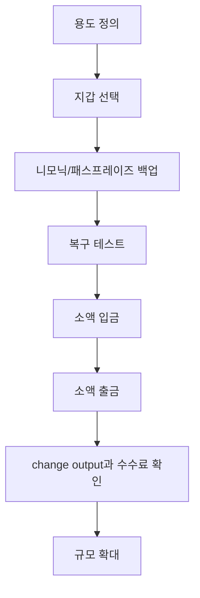

> [!info] 빠른 연결
> 허브: [[04_보관과_운영/index]]
> 먼저 읽기: [[03_업그레이드와_개발/지갑표준]]
> 함께 보기: [[04_보관과_운영/지갑선택매트릭스]] · [[07_프라이버시와_실사용/KYC와주소재사용과코인컨트롤]] · [[09_도서와_자료/필레몬의비트코인사용가이드]]

좋은 비트코인 사용 습관은 거래소 로그인보다 훨씬 먼저 시작되어야 한다. 지갑을 고를 때 사용자는 보안 모델, 백업 방식, coin control 지원, RBF 지원, 하드웨어 연동, 오픈소스 여부, 커뮤니티 검증 정도를 함께 봐야 한다. “예쁘다” 혹은 “사용자가 많다”는 이유만으로 선택하면 장기적으로 자산 규모가 커질수록 문제가 드러난다.

가장 중요한 원칙은 단순하다. **소액으로 먼저 복구 연습까지 끝낸 뒤 규모를 키워라.** 니모닉을 적고 끝내지 말고, 실제로 다른 장치에서 복원해 보고, change output과 수수료 조절, 주소 재사용 금지, QR 검증, 테스트 송금까지 해 봐야 한다.

## 지갑 도입 절차

## 처음부터 지켜야 할 원칙

첫째, 주소 재사용을 피한다. 둘째, 니모닉은 사진이나 클라우드 메모에 남기지 않는다. 셋째, 장치 잠금과 업데이트를 생활화한다. 넷째, 소액 테스트 없이 큰 금액을 이동하지 않는다. 다섯째, 지갑이 보여 주는 잔고보다 실제 UTXO 구조와 출처를 이해하려고 노력한다. 이 다섯 가지만 지켜도 대부분의 참사는 예방된다.

## 온체인 지갑과 라이트닝 지갑을 분리하라

많은 초심자가 하나의 앱으로 모든 것을 해결하고 싶어 한다. 하지만 장기 보관, 일상 결제, 실험용 자금은 서로 다른 위협 모델을 가진다. 장기 보관 지갑은 느리고 신중해도 좋지만, 결제 지갑은 빠르고 가벼워야 한다. 그래서 실전에서는 **금고 지갑, 소비 지갑, 테스트 지갑**을 분리하는 편이 좋다.

## coin control과 수수료 감각

장기적으로는 지갑의 coin control 기능을 배우는 것이 좋다. 어떤 UTXO를 함께 쓰느냐는 프라이버시와 회계에 영향을 준다. 또한 수수료는 고정 수수료가 아니라 네트워크 혼잡과 트랜잭션 크기에 따라 달라진다. 따라서 급할 때와 급하지 않을 때의 fee 전략을 구분하고, RBF/CPFP 같은 구조를 이해하면 훨씬 안정적으로 사용할 수 있다.

## 언제 하드웨어 월렛으로 넘어가야 하는가

금액이 커질수록 서명 키를 범용 기기에서 분리하는 편이 유리하다. 다만 “금액이 크다”는 절대값이 아니라, **내가 잃으면 견딜 수 없는 수준인가**로 판단하는 것이 좋다. 하드웨어 월렛은 마법 장비가 아니고, 사용자의 절차가 좋아질 때 비로소 힘을 발휘한다. 그래서 [[04_보관과_운영/하드웨어월렛과멀티시그]]로 넘어가기 전에 이 문서와 [[04_보관과_운영/백업복구훈련]]을 먼저 충분히 익히는 편이 좋다.

## 보충 해설

보관과 운영 문서는 늘 장비 소개로 소비되기 쉽지만, 실제 핵심은 절차와 훈련이다. 셀프커스터디는 영웅적 결단이 아니라, 평소에 작고 반복 가능한 절차를 어떻게 설계하느냐의 문제다. 백업, 복구, 주소 검증, 테스트 송금, 노드 동기화, 패스프레이즈 사용 여부, 가족과의 상속 계획까지 모두 같은 사슬의 일부다.

이 폴더를 잘 읽는 요령은 '최강 보안'이라는 환상에서 벗어나는 것이다. 현실에는 늘 trade-off가 있다. 너무 복잡하면 사용자가 우회하고, 너무 단순하면 공격면이 넓어진다. 좋은 운영은 내 생활 패턴, 금액 규모, 이동 빈도, 동거인 위험, 법적 환경까지 넣고 설계한 적정 복잡도에서 나온다.

## 사용 습관이 보안의 대부분을 결정한다
지갑 앱의 안전성은 코드 품질만으로 완성되지 않는다. 어떤 네트워크에서 다운로드했는지, 백업을 어디에 남겼는지, 테스트 전송을 해 보았는지, 주소와 금액을 서명 장치에서 다시 확인했는지 같은 습관이 실제 사고 확률을 좌우한다. 그래서 개인지갑 사용 가이드는 기능 소개서보다 행동 훈련 문서에 가깝다.

특히 이 문서에서 중요한 감각은 '작게 시작해서 반복 검증한 뒤 규모를 키운다'는 원칙이다. 초심자는 한 번의 큰 설정으로 모든 위험을 제거하려 들기 쉬운데, 실제로는 작은 송금, 복구 실험, 주소 확인, 수수료 조절 같은 반복 경험이 더 큰 안전을 준다. 지갑 숙련도는 읽어서보다, 훈련해서 쌓이는 경우가 훨씬 많다.

## 연결해서 읽기

이 문서는 [[04_보관과_운영/index]] · [[03_업그레이드와_개발/지갑표준]] · [[04_보관과_운영/지갑선택매트릭스]]와 함께 읽을 때 입체감이 커진다. [[04_보관과_운영/index]] 문서는 셀프커스터디 실무 층위를 보강한다 / [[03_업그레이드와_개발/지갑표준]] 문서는 변경과 구현의 경로 층위를 보강한다 / [[04_보관과_운영/지갑선택매트릭스]] 문서는 셀프커스터디 실무 층위를 보강한다. 한 문서를 읽고 바로 이웃 문서로 건너가는 식으로 그래프를 타면, 같은 개념이 철학·기술·운영·역사 중 어느 층에서 다시 등장하는지 빠르게 감이 잡힌다.

특히 개인지갑 사용 가이드 같은 문서는 단독 정의보다 연결 속에서 의미가 커진다. 비트코인 지식은 선형 교재보다 네트워크 구조에 가깝기 때문에, 인접 노드 한두 개만 함께 읽어도 오해가 크게 줄어드는 경우가 많다.

## 스스로 점검할 질문

이 문서를 읽고 나면 적어도 세 가지 질문에는 자기 언어로 답해 볼 수 있어야 한다. 이 절차를 내가 실제로 한 번 복구해 본 적이 있는가, 내 실수 패턴은 무엇인가, 가족이나 동료가 개입하면 어떤 취약점이 생기는가. 이 질문에 막히는 부분이 있다면 아직 개념 하나가 덜 붙은 것이므로, 바로 옆 문서와 함께 다시 읽는 편이 좋다.

## 보충 메모

'개인지갑 사용 가이드' 문서는 이 위키에서 셀프커스터디와 운영 절차 축을 지탱하는 노드다. 그래서 핵심 정의만 이해하는 것으로는 충분하지 않고, 그 정의가 다른 문서에서 어떻게 다시 쓰이는지까지 보는 편이 좋다. 비트코인 공부가 어려운 이유는 개념 수가 많아서가 아니라, 같은 개념이 여러 층에서 다른 역할을 맡기 때문이다.

독자가 지금 당장 모든 세부를 기억할 필요는 없다. 다만 이 문서의 문제의식이 왜 [[index]]로 돌아가 다른 갈래와 연결되는지, 그리고 왜 이 문서를 읽은 뒤 다시 실전 문서나 역사 문서로 건너가야 하는지만 분명히 붙잡으면 된다. 그런 식으로 왕복 독서를 할수록 지식은 목록이 아니라 구조가 된다.
