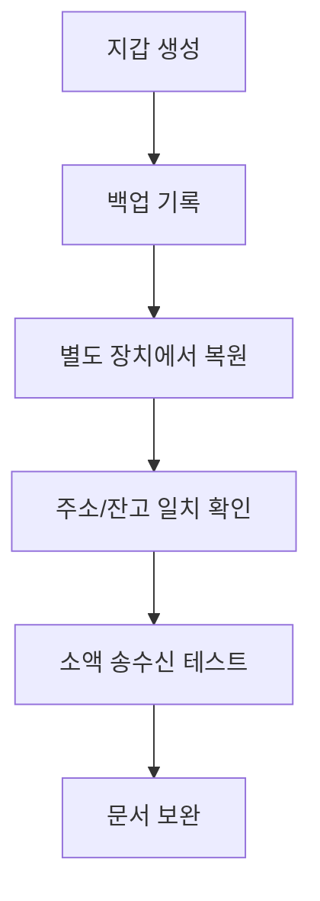

> [!info] 빠른 연결
> 허브: [[04_보관과_운영/index]]
> 함께 보기: [[04_보관과_운영/지갑선택매트릭스]] · [[04_보관과_운영/상속과비상계획]]

니모닉을 적어 두는 것과 복구 능력을 갖추는 것은 완전히 다른 일이다. 많은 사용자가 백업을 “글자를 적어 둔 상태”로 이해하지만, 실제 백업은 **손실 상황에서 자산을 되찾는 절차 전체**를 뜻한다. 즉 종이 한 장이 아니라 훈련, 문서화, 장치 검증, 시간 경과에 따른 점검이 모두 포함된다.

## 왜 복구 훈련이 필요한가

- 니모닉을 잘못 적어 놓았을 수 있다.
- 단어 순서, 추가 패스프레이즈, 계정 경로를 헷갈릴 수 있다.
- 어떤 지갑은 복구 후 주소 파생 방식이 다를 수 있다.
- 실제 사고가 나면 평소보다 훨씬 더 당황한 상태가 된다.

## 최소 훈련 루틴

1. 새 지갑을 만든다.
2. 니모닉과 필요한 추가 정보(패스프레이즈, 계정 구조)를 오프라인에 기록한다.
3. 완전히 다른 장치나 테스트 환경에서 복원한다.
4. 동일한 수신 주소 또는 동일한 잔고 구조가 재현되는지 확인한다.
5. 아주 작은 금액을 보내고 다시 회수해 본다.
6. 이 절차를 주기적으로 반복한다.

## 멀티시그에서는 더 중요하다

멀티시그에서는 백업이 단어 목록만의 문제가 아니다. 기기 배치, 코시그너 정보, descriptor, PSBT 흐름, 복구 순서, 역할 분담까지 모두 기록해야 한다. “각자 니모닉만 하나씩 갖고 있으면 되겠지”라는 생각은 재난 상황에서 거의 항상 부족하다.

## 상속과 연결

복구 훈련은 내 생존 시나리오만 위한 것이 아니다. 가족과 파트너, 공동관리자가 나 없이도 절차를 따라올 수 있어야 한다. 그래서 복구 훈련은 [[04_보관과_운영/상속과비상계획]]과 분리할 수 없다.

## 보충 해설

보관과 운영 문서는 늘 장비 소개로 소비되기 쉽지만, 실제 핵심은 절차와 훈련이다. 셀프커스터디는 영웅적 결단이 아니라, 평소에 작고 반복 가능한 절차를 어떻게 설계하느냐의 문제다. 백업, 복구, 주소 검증, 테스트 송금, 노드 동기화, 패스프레이즈 사용 여부, 가족과의 상속 계획까지 모두 같은 사슬의 일부다.

이 폴더를 잘 읽는 요령은 '최강 보안'이라는 환상에서 벗어나는 것이다. 현실에는 늘 trade-off가 있다. 너무 복잡하면 사용자가 우회하고, 너무 단순하면 공격면이 넓어진다. 좋은 운영은 내 생활 패턴, 금액 규모, 이동 빈도, 동거인 위험, 법적 환경까지 넣고 설계한 적정 복잡도에서 나온다.

## 백업은 적어 두는 행위가 아니라 복구 가능한 상태
니모닉을 종이에 적어 둔 순간 안심하는 사용자가 많지만, 진짜 질문은 '오늘 장치가 사라져도 내가 복구할 수 있는가'다. 복구 훈련이 없는 백업은 절반짜리 백업이다. 파생 경로, 패스프레이즈, 스크립트 유형, 멀티시그 참여자, 주소 검증 습관 중 하나만 빠져도 실제 복구 상황에서는 큰 혼란이 온다.

따라서 백업 복구 훈련은 재난이 오기 전에 혼란을 미리 경험해 보는 절차다. 다른 장치에서 복원해 보고, 소액을 다시 전송해 보고, 설명 문서가 제3자에게도 읽히는지 점검해야 한다. 이 훈련은 귀찮지만, 바로 이 반복이 셀프커스터디를 감정의 문제가 아닌 절차의 문제로 바꿔 준다.

## 연결해서 읽기

이 문서는 [[04_보관과_운영/index]] · [[04_보관과_운영/지갑선택매트릭스]] · [[04_보관과_운영/상속과비상계획]]와 함께 읽을 때 입체감이 커진다. [[04_보관과_운영/index]] 문서는 셀프커스터디 실무 층위를 보강한다 / [[04_보관과_운영/지갑선택매트릭스]] 문서는 셀프커스터디 실무 층위를 보강한다 / [[04_보관과_운영/상속과비상계획]] 문서는 셀프커스터디 실무 층위를 보강한다. 한 문서를 읽고 바로 이웃 문서로 건너가는 식으로 그래프를 타면, 같은 개념이 철학·기술·운영·역사 중 어느 층에서 다시 등장하는지 빠르게 감이 잡힌다.

특히 백업 복구 훈련 같은 문서는 단독 정의보다 연결 속에서 의미가 커진다. 비트코인 지식은 선형 교재보다 네트워크 구조에 가깝기 때문에, 인접 노드 한두 개만 함께 읽어도 오해가 크게 줄어드는 경우가 많다.

## 스스로 점검할 질문

이 문서를 읽고 나면 적어도 세 가지 질문에는 자기 언어로 답해 볼 수 있어야 한다. 이 절차를 내가 실제로 한 번 복구해 본 적이 있는가, 내 실수 패턴은 무엇인가, 가족이나 동료가 개입하면 어떤 취약점이 생기는가. 이 질문에 막히는 부분이 있다면 아직 개념 하나가 덜 붙은 것이므로, 바로 옆 문서와 함께 다시 읽는 편이 좋다.
