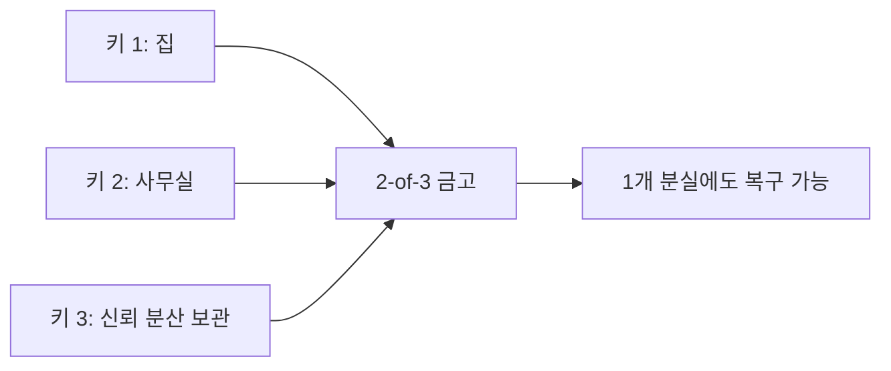

> [!info] 빠른 연결
> 허브: [[04_보관과_운영/index]]
> 먼저 읽기: [[03_업그레이드와_개발/지갑표준]]
> 함께 보기: [[03_업그레이드와_개발/Descriptors와Miniscript]] · [[04_보관과_운영/상속과비상계획]]

금액이 커질수록 보관 구조는 지갑 앱 하나를 넘어서야 한다. 하드웨어 월렛은 비밀키를 일반 목적 컴퓨터와 분리해 서명 공격면을 크게 줄이고, 멀티시그는 단일 장비 손상이나 단일 인적 실패가 즉시 자산 상실로 이어지지 않게 만든다. 그러나 이 구조는 만능이 아니다. 복잡성이 늘어나면 운영 실수와 상속 난이도도 함께 올라간다.

그래서 좋은 멀티시그는 최대한 '영리한 구조'가 아니라 **복구 가능한 구조**여야 한다. 장비 제조사 다양화, 지리적 분산, 문서화, 정기 복구 훈련, descriptor 및 PSBT 이해가 함께 가야 한다.

## 2-of-3 멀티시그의 기본 그림

## 언제 필요한가

모든 사용자에게 멀티시그가 필요한 것은 아니다. 소액 사용자라면 단일 하드웨어 월렛과 좋은 백업만으로도 충분할 수 있다. 멀티시그는 자산 규모가 커지거나, 공동 의사결정이 필요하거나, 단일 실패지점을 제거해야 할 때 가치가 커진다. 복잡성은 항상 비용이므로, 필요보다 과한 구조는 오히려 해롭다.

## 제조사 다양화와 운영

동일 제조사 장비만 여러 대 쓰는 것보다, 가능한 한 구현이 다른 장비를 섞는 편이 좋다. 펌웨어 버그, 공급망 문제, UX 결함이 동시다발적으로 같은 방향으로 발생할 가능성을 줄이기 때문이다. 동시에 coordinator 소프트웨어와 descriptor 기록, PSBT 흐름을 이해해 특정 앱에 잠기지 않도록 해야 한다.

## 가장 흔한 실패

멀티시그의 가장 흔한 실패는 해킹이 아니라 문서 부재다. 어떤 스크립트 정책이었는지, 어떤 장비를 어떤 순서로 복구해야 하는지, xpub/descriptors가 어디 있는지, 남은 가족이 무엇을 해야 하는지가 정리되어 있지 않으면 구조가 아무리 튼튼해도 실제로는 취약하다. 그래서 멀티시그는 기술이 아니라 운영 문서 프로젝트이기도 하다.

## 참고 문헌과 원전

- Multisig best practice materials.
- PSBT and descriptors documentation.

## 보충 해설

보관과 운영 문서는 늘 장비 소개로 소비되기 쉽지만, 실제 핵심은 절차와 훈련이다. 셀프커스터디는 영웅적 결단이 아니라, 평소에 작고 반복 가능한 절차를 어떻게 설계하느냐의 문제다. 백업, 복구, 주소 검증, 테스트 송금, 노드 동기화, 패스프레이즈 사용 여부, 가족과의 상속 계획까지 모두 같은 사슬의 일부다.

이 폴더를 잘 읽는 요령은 '최강 보안'이라는 환상에서 벗어나는 것이다. 현실에는 늘 trade-off가 있다. 너무 복잡하면 사용자가 우회하고, 너무 단순하면 공격면이 넓어진다. 좋은 운영은 내 생활 패턴, 금액 규모, 이동 빈도, 동거인 위험, 법적 환경까지 넣고 설계한 적정 복잡도에서 나온다.

## 장치와 구조를 분리해서 생각하기
하드웨어 월렛은 비밀키를 범용 컴퓨터에서 떼어 놓는 훌륭한 장치지만, 그 자체로 완전한 해법은 아니다. 펌웨어 공급망, 주소 표시 확인, 백업 절차, 패스프레이즈 사용, 제조사 신뢰, 멀티시그 호환성, 복구 가능성까지 함께 봐야 비로소 안전해진다. 장치는 안전의 한 요소이지, 절차 전체를 대신해 주는 마법 상자가 아니다.

또한 멀티시그와 결합하면 하드웨어 월렛의 의미가 달라진다. 단일 장치 실패를 흡수하고, 제조사 위험을 분산하고, 상속과 조직 운영을 더 정교하게 설계할 수 있기 때문이다. 그래서 이 문서는 제품 리뷰보다 '어떤 구조가 어떤 사용자에게 적합한가'를 더 많이 생각하게 만드는 문서여야 한다.

## 연결해서 읽기

이 문서는 [[04_보관과_운영/index]] · [[03_업그레이드와_개발/지갑표준]] · [[03_업그레이드와_개발/Descriptors와Miniscript]]와 함께 읽을 때 입체감이 커진다. [[04_보관과_운영/index]] 문서는 셀프커스터디 실무 층위를 보강한다 / [[03_업그레이드와_개발/지갑표준]] 문서는 변경과 구현의 경로 층위를 보강한다 / [[03_업그레이드와_개발/Descriptors와Miniscript]] 문서는 변경과 구현의 경로 층위를 보강한다. 한 문서를 읽고 바로 이웃 문서로 건너가는 식으로 그래프를 타면, 같은 개념이 철학·기술·운영·역사 중 어느 층에서 다시 등장하는지 빠르게 감이 잡힌다.

특히 하드웨어월렛과 멀티시그 같은 문서는 단독 정의보다 연결 속에서 의미가 커진다. 비트코인 지식은 선형 교재보다 네트워크 구조에 가깝기 때문에, 인접 노드 한두 개만 함께 읽어도 오해가 크게 줄어드는 경우가 많다.

## 스스로 점검할 질문

이 문서를 읽고 나면 적어도 세 가지 질문에는 자기 언어로 답해 볼 수 있어야 한다. 이 절차를 내가 실제로 한 번 복구해 본 적이 있는가, 내 실수 패턴은 무엇인가, 가족이나 동료가 개입하면 어떤 취약점이 생기는가. 이 질문에 막히는 부분이 있다면 아직 개념 하나가 덜 붙은 것이므로, 바로 옆 문서와 함께 다시 읽는 편이 좋다.
