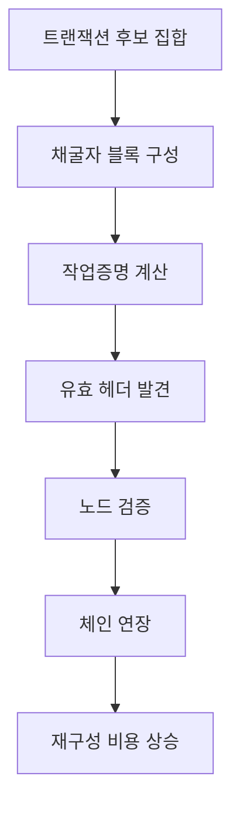

> [!info] 빠른 연결
> 허브: [[05_채굴과_인프라/index]]
> 함께 보기: [[05_채굴과_인프라/반감기와발행정책]] · [[02_프로토콜/노드와합의]]

작업증명은 비트코인이 블록 순서를 정하는 방식이다. 채굴자는 블록 헤더의 유효한 nonce를 찾기 위해 해시를 반복하고, 노드는 누적 작업이 더 많은 유효 체인을 따른다. 이 구조 덕분에 과거 체인을 다시 쓰려면 막대한 전력과 하드웨어 비용을 다시 치러야 한다.

난이도 조정은 이 구조를 안정화하는 장치다. 해시레이트가 늘거나 줄어도 평균 10분 안팎의 블록 간격을 목표로 맞춰 주기 때문에, 블록 생산 리듬과 발행 스케줄이 너무 크게 흔들리지 않는다.

## 사실

- 노드는 “가장 긴 체인”이 아니라 **가장 많은 누적 작업이 쌓인 유효 체인**을 따른다.
- 난이도 조정은 대략 2주 주기로 적용된다.
- 채굴자는 블록 템플릿을 만들고 ASIC은 nonce 공간을 탐색한다.
- 난이도와 현재 상황은 `getmininginfo`, 템플릿 구성은 `getblocktemplate`으로 확인할 수 있다.

## 채굴 보안의 흐름

## 해석

- 작업증명은 단순 퍼즐이 아니라 공격 비용을 만드는 설계다.
- 난이도 조정은 비트코인이 중앙기관 없이도 리듬을 유지하게 하는 피드백 루프다.
- 난이도는 기술 파라미터이면서 동시에 산업 구조를 거르는 시장 파라미터다.

## 입문자 메모

1. “difficulty”와 “hashrate”를 섞지 말 것.
2. 블록 간격이 흔들려도 규칙은 난이도 조정으로 다시 맞춰진다는 점을 기억할 것.
3. 실제 운영 숫자는 `getmininginfo`와 `getblocktemplate`로 먼저 확인할 것.

## 참고 원전

- [Bitcoin white paper](https://bitcoin.org/en/bitcoin-paper.html)
- [Bitcoin Developer Guide - Mining](https://developer.bitcoin.org/devguide/mining.html)
- [Bitcoin Developer Guide - Block chain](https://developer.bitcoin.org/devguide/block_chain.html)
- [Bitcoin Core getmininginfo](https://bitcoincore.org/en/doc/29.0.0/rpc/mining/getmininginfo/)
- [Bitcoin Core getblocktemplate](https://bitcoincore.org/en/doc/29.0.0/rpc/mining/getblocktemplate/)

## 연결해서 읽기

이 문서는 [[05_채굴과_인프라/index]]와 [[05_채굴과_인프라/반감기와발행정책]]를 함께 보면 발행과 보안이 어떻게 한 리듬으로 묶이는지 보이고, [[02_프로토콜/노드와합의]]를 같이 보면 왜 누적 작업이 합의 기준이 되는지 선명해진다.
