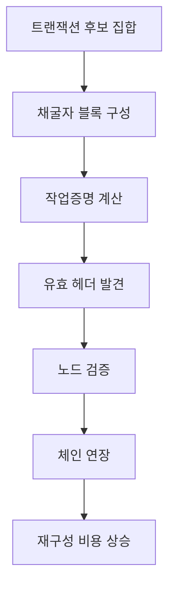

> [!info] 빠른 연결
> 허브: [[05_채굴과_인프라/index]]
> 함께 보기: [[05_채굴과_인프라/반감기와발행정책]] · [[02_프로토콜/노드와합의]]

작업증명은 비트코인이 시간 순서를 정하는 방법이다. 채굴자는 유효한 블록 헤더를 찾기 위해 해시 계산을 반복하고, 네트워크는 가장 많은 누적 작업이 쌓인 유효 체인을 선호한다. 이 구조 덕분에 공격자는 과거를 뒤엎으려면 막대한 에너지와 하드웨어를 다시 투입해야 한다. 보안이 단순 서약이 아니라 비용 구조에 묶이는 것이다.

난이도 조정은 이 메커니즘의 숨은 주인공이다. 해시레이트가 급증하거나 급감해도 평균 10분 내외의 블록 간격을 유지하도록 조절해, 발행 일정과 체인 리듬을 비교적 안정적으로 지킨다. 공급 일정의 신뢰성은 결국 난이도 조정이 현장에서 굴러가는 덕분이다.

## 채굴 보안의 흐름

## 에너지와 보안의 연결

비트코인의 중요한 통찰은 디지털 희소성을 사회적 약속만으로 유지하지 않는다는 데 있다. 에너지와 하드웨어라는 현실 세계의 비용을 통해 공격 비용을 만든다. 이 때문에 작업증명은 낭비냐 아니냐의 도덕 논쟁으로만 읽을 수 없다. 그 에너지 소비가 어떤 보안 서비스를 구매하는지 따져야 한다.

## 난이도 조정의 우아함

해시레이트가 늘면 블록이 빨라지고, 난이도는 이를 다시 높여 리듬을 원래 수준으로 되돌린다. 반대로 해시레이트가 빠지면 블록이 느려지고, 차기 조정에서 난이도가 낮아져 채굴이 다시 가능해진다. 이 되먹임 덕분에 어떤 중앙기관도 없는 시스템이 장기간 발행 일정을 유지할 수 있다.

## 참고 문헌과 원전

- Bitcoin whitepaper sections on proof-of-work and incentive.
- Mining explainer resources.

## 보충 해설

채굴 문서를 읽을 때는 비트코인을 순수한 소프트웨어로만 보면 놓치는 것이 많다. 체인워크와 최종성은 결국 현실 세계의 전력, 설비, 물류, 금융 비용, 규제, 냉각, 지역별 전력 시장과 맞물린다. 따라서 채굴은 코드 바깥의 산업 구조가 어떻게 합의 보안으로 번역되는지 보여 주는 접점이다.

동시에 채굴은 단순한 '전기 낭비' 논쟁으로 환원되기 어렵다. 난이도 조정, 반감기, 해시가격, 풀 중앙화, 수요 반응, 좌초 에너지 활용 같은 요소들이 맞물려 있기 때문이다. 이 폴더의 글들은 채굴을 미화하려 하기보다, 어떤 경제적 유인이 어떤 형태의 중앙화와 분산화를 동시에 낳는지 추적하는 데 초점을 둔다.

## 난이도 조정이 만드는 자기 안정성
난이도 조정은 비트코인이 중앙 관리 없이도 블록 생산 리듬을 유지하게 만드는 핵심 장치다. 해시레이트가 급증하거나 급감해도 일정 주기마다 목표 난이도를 재조정함으로써 평균 블록 간격을 회복하려 한다. 이 메커니즘 덕분에 네트워크는 참여자의 규모와 장비 세대가 바뀌어도 기본 리듬을 잃지 않는다.

동시에 난이도 조정은 채굴 산업의 경쟁을 끊임없이 재편한다. 효율이 낮은 장비는 탈락하고, 전력 가격과 자본 비용이 다른 채굴자들이 다른 속도로 살아남는다. 따라서 난이도는 순수 기술 파라미터가 아니라 산업 구조를 조절하는 보이지 않는 손이기도 하다.

## 연결해서 읽기

이 문서는 [[05_채굴과_인프라/index]] · [[05_채굴과_인프라/반감기와발행정책]] · [[02_프로토콜/노드와합의]]와 함께 읽을 때 입체감이 커진다. [[05_채굴과_인프라/index]] 문서는 보안 비용과 채굴 산업 층위를 보강한다 / [[05_채굴과_인프라/반감기와발행정책]] 문서는 보안 비용과 채굴 산업 층위를 보강한다 / [[02_프로토콜/노드와합의]] 문서는 규칙과 검증 구조 층위를 보강한다. 한 문서를 읽고 바로 이웃 문서로 건너가는 식으로 그래프를 타면, 같은 개념이 철학·기술·운영·역사 중 어느 층에서 다시 등장하는지 빠르게 감이 잡힌다.

특히 채굴과 난이도 조정 같은 문서는 단독 정의보다 연결 속에서 의미가 커진다. 비트코인 지식은 선형 교재보다 네트워크 구조에 가깝기 때문에, 인접 노드 한두 개만 함께 읽어도 오해가 크게 줄어드는 경우가 많다.

## 스스로 점검할 질문

이 문서를 읽고 나면 적어도 세 가지 질문에는 자기 언어로 답해 볼 수 있어야 한다. 이 인센티브가 어떤 산업 구조를 낳는가, 중앙화 압력은 어디서 생기는가, 보안 비용은 어떻게 사회적으로 분담되는가. 이 질문에 막히는 부분이 있다면 아직 개념 하나가 덜 붙은 것이므로, 바로 옆 문서와 함께 다시 읽는 편이 좋다.
