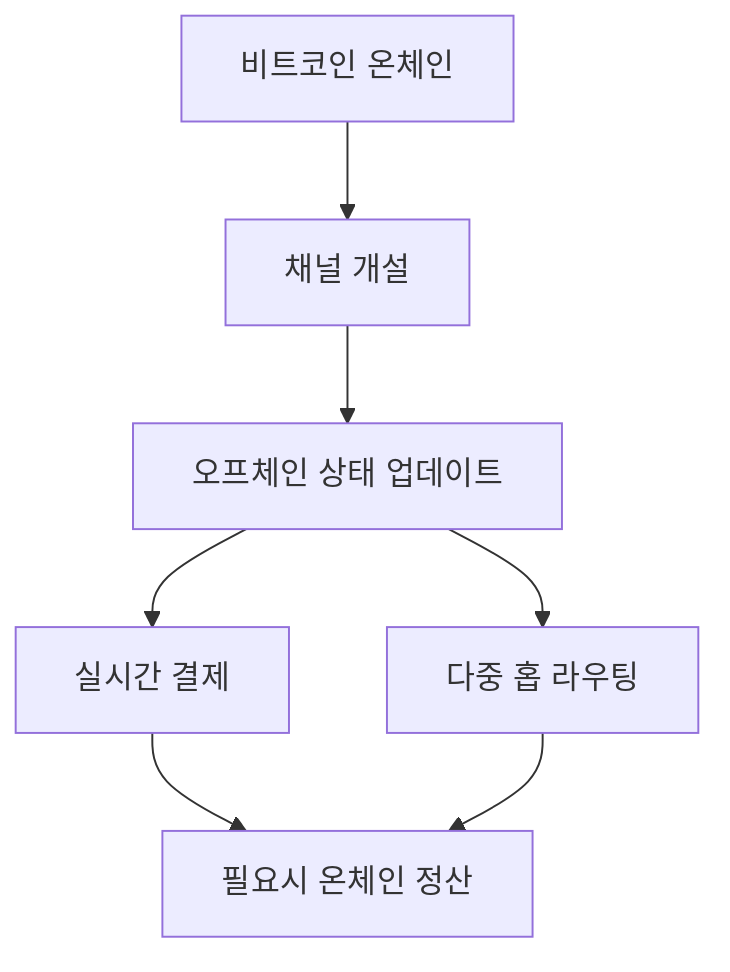

> [!info] 빠른 연결
> 허브: [[index]]

라이트닝은 비트코인을 대체하는 체인이 아니라, 비트코인 위에 올라가는 결제 레이어다. 핵심 아이디어는 모든 결제를 온체인에 직접 기록하지 않고, 채널을 열어 다수의 상태 업데이트를 오프체인으로 교환한 뒤 필요할 때만 정산하는 것이다.

## 온체인과 라이트닝의 관계

## 문서 지도

| 문서 | 초점 |
|---|---|
| [[06_라이트닝/라이트닝개요]] | 왜 필요한가, 무엇을 trade-off 하는가 |
| [[06_라이트닝/채널HTLC라우팅]] | 채널과 경로의 기술적 기초 |
| [[06_라이트닝/유동성관리와수익모델]] | inbound/outbound liquidity와 운영 감각 |
| [[06_라이트닝/워치타워와채널보안]] | 온라인성, 페널티, 감시 구조 |
| [[06_라이트닝/라이트닝실사용가이드]] | 실제 결제와 운영 습관 |
| [[06_라이트닝/라이트닝구현체비교]] | LND, Core Lightning, Eclair 계열 감각 |
| [[06_라이트닝/BOLT12AMP스플라이싱]] | 인보이스와 실사용 UX의 변화 |
| [[06_라이트닝/PTLC와탭루트채널]] | 다음 세대 채널 구조와 결제 프리미티브 |

## 보충 해설

라이트닝 문서는 '빠르고 싼 비트코인 결제'라는 홍보 문구로 읽으면 곧 벽에 부딪힌다. 실제 네트워크는 채널 개설, 유동성 배치, 라우팅 신뢰도, 수취 방식, 온라인 가용성, 워치타워, 구현체 차이 같은 운영적 질문으로 이루어진다. 즉 라이트닝은 단순한 앱 기능이 아니라, 상호 연결된 결제 그래프와 유동성 장치다.

라이트닝을 이해하는 가장 좋은 방법은 온체인과 대립시키지 않는 것이다. 온체인이 최종 결제와 공개 규칙의 층이라면, 라이트닝은 빈번한 교환을 가능하게 하는 상위 레이어다. 그래서 이 폴더에서는 채널이라는 회계 단위와 라우팅이라는 네트워크 단위, 그리고 사용자 경험이라는 서비스 단위를 함께 읽게 된다.

## 이 폴더가 보여 주는 상위 레이어의 현실
라이트닝 허브를 보면 비트코인이 왜 단일 온체인만으로 끝나지 않는지 알 수 있다. 일상 결제와 잦은 소액 거래를 모두 기초 레이어에서 처리하려 들면, 비용과 처리량, 사용자 경험이 금세 제약에 부딪힌다. 라이트닝은 이런 제약 위에서 생겨난 상위 결제 레이어로, 최종 결제의 보장을 온체인에 두고 빈번한 교환을 오프체인 채널로 옮긴다.

하지만 이 허브는 라이트닝을 마법 같은 해법으로 그리지 않는다. 채널 개설 비용, 유동성 배치, 온라인 상태 유지, 라우팅 실패, 구현체 차이, 보안 감시 같은 현실 문제가 분명히 있기 때문이다. 그래서 라이트닝을 배운다는 것은 '비트코인이 빠르다'를 배우는 것이 아니라, 결제 네트워크를 운영 가능한 형태로 이해하는 일에 가깝다.

## 연결해서 읽기

이 문서는 [[index]] · [[06_라이트닝/라이트닝개요]] · [[06_라이트닝/채널HTLC라우팅]]와 함께 읽을 때 입체감이 커진다. [[index]] 문서는 전체 허브 층위를 보강한다 / [[06_라이트닝/라이트닝개요]] 문서는 결제 확장과 유동성 층위를 보강한다 / [[06_라이트닝/채널HTLC라우팅]] 문서는 결제 확장과 유동성 층위를 보강한다. 한 문서를 읽고 바로 이웃 문서로 건너가는 식으로 그래프를 타면, 같은 개념이 철학·기술·운영·역사 중 어느 층에서 다시 등장하는지 빠르게 감이 잡힌다.

특히 라이트닝 같은 문서는 단독 정의보다 연결 속에서 의미가 커진다. 비트코인 지식은 선형 교재보다 네트워크 구조에 가깝기 때문에, 인접 노드 한두 개만 함께 읽어도 오해가 크게 줄어드는 경우가 많다.

## 스스로 점검할 질문

이 문서를 읽고 나면 적어도 세 가지 질문에는 자기 언어로 답해 볼 수 있어야 한다. 결제는 왜 실패하는가, 유동성은 어디에 묶이는가, 온체인과 오프체인 경계는 어떻게 관리되는가. 이 질문에 막히는 부분이 있다면 아직 개념 하나가 덜 붙은 것이므로, 바로 옆 문서와 함께 다시 읽는 편이 좋다.
