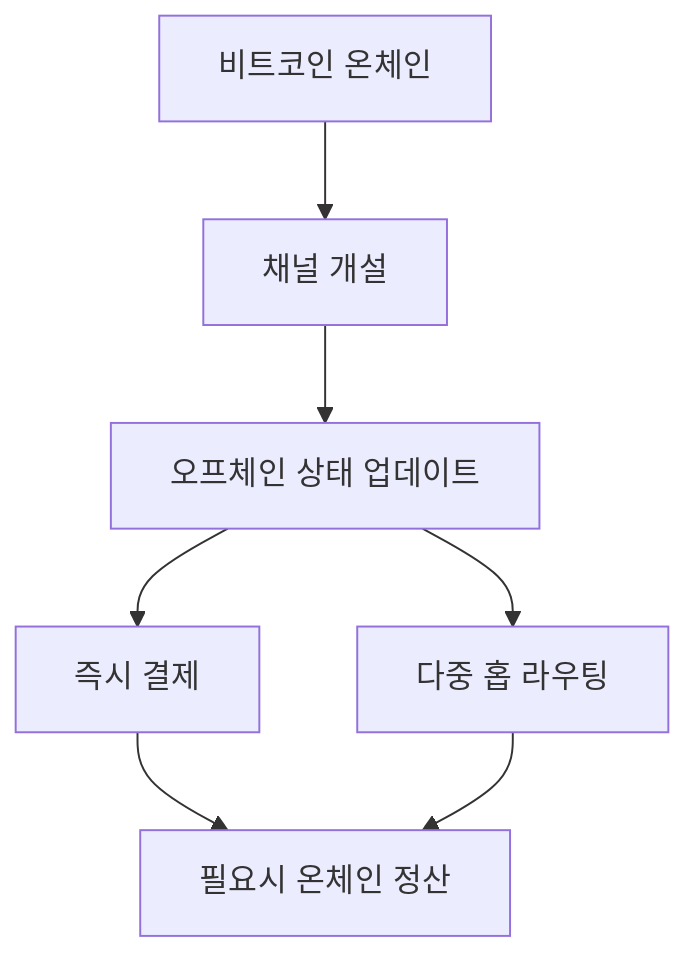

라이트닝은 비트코인을 대체하는 체인이 아니라, 비트코인 위에 얹히는 결제 레이어다. 표준 문서에서는 피어 프로토콜, onion routing, routing gossip, payment encoding, offer encoding을 분리해서 정의한다. 이 허브는 그 조각들을 한 번에 보이게 하려는 지도 역할을 한다.

## 문서 지도

| 문서 | 초점 |
|---|---|
| [[06_라이트닝/라이트닝개요]] | 왜 필요한지, 무엇을 포기하는지 |
| [[06_라이트닝/채널HTLC라우팅]] | 채널, HTLC, 경로 탐색의 기본 |
| [[06_라이트닝/유동성관리와수익모델]] | inbound/outbound 유동성, 운영 감각 |
| [[06_라이트닝/워치타워와채널보안]] | 온라인성, 감시, 백업 |
| [[06_라이트닝/라이트닝실사용가이드]] | 실제 결제 습관과 주의점 |
| [[06_라이트닝/라이트닝구현체비교]] | LND, Core Lightning, Eclair 비교 |
| [[06_라이트닝/BOLT12AMP스플라이싱]] | BOLT12, AMP, 스플라이싱의 차이 |
| [[06_라이트닝/PTLC와탭루트채널]] | Taproot 이후의 채널 설계 방향 |

## 표준 기준 핵심

- [BOLT 2](https://github.com/lightning/bolts/blob/master/02-peer-protocol.md): 피어 연결과 채널 관련 메시지
- [BOLT 4](https://github.com/lightning/bolts/blob/master/04-onion-routing.md): onion routing
- [BOLT 7](https://github.com/lightning/bolts/blob/master/07-routing-gossip.md): 라우팅 gossip
- [BOLT 11](https://github.com/lightning/bolts/blob/master/11-payment-encoding.md): 인보이스 인코딩
- [BOLT 12](https://github.com/lightning/bolts/blob/master/12-offer-encoding.md): offers / offer encoding

## 입문 팁

처음 읽을 때는 “빠른 송금”보다 “채널 상태를 어떻게 보존하고 경로를 어떻게 찾는가”에 집중하는 편이 낫다. 결제 실패는 종종 정상적인 네트워크 현상이고, 유동성은 잔고가 아니라 방향성을 가진 자원이다.

실사용 문서는 [[06_라이트닝/라이트닝실사용가이드]]에서 시작하고, 구조는 [[06_라이트닝/채널HTLC라우팅]]와 [[06_라이트닝/유동성관리와수익모델]]로 내려가면 된다.

## 참고

- [lightning/bolts](https://github.com/lightning/bolts)
- [Core Lightning 문서](https://docs.corelightning.org/)
- [LND Builder's Guide](https://docs.lightning.engineering/lightning-network-tools/lnd)
