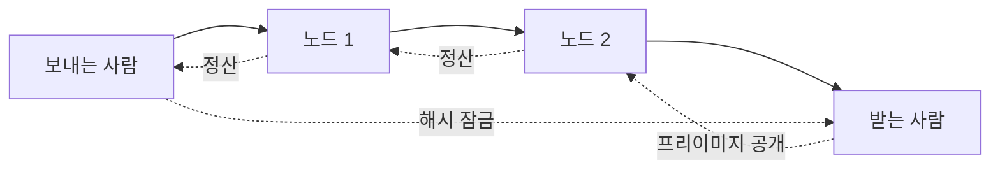

> [!info] 빠른 연결
> 허브: [[06_라이트닝/index]]
> 함께 보기: [[06_라이트닝/BOLT12AMP스플라이싱]] · [[03_업그레이드와_개발/CTVAPOCAT와미래제안]]

채널은 두 참가자가 공유하는 결제 상태의 단위다. HTLC는 조건부 전달 장치이고, 라우팅은 분산된 채널 그래프 위에서 목적지까지 경로를 찾는 문제다. 이 셋을 함께 봐야 라이트닝이 “신뢰 없이 빠른 결제”를 어떻게 구현하는지 보인다.

## 사실

- 채널은 양방향이다.
- HTLC는 해시와 시간 제한으로 조건부 결제를 연결한다.
- 경로 성공 여부는 중간 노드의 유동성, 수수료 정책, 네트워크 가용성에 좌우된다.

## 해석

라이트닝의 기술적 핵심은 암호학보다 운영이다. 결제는 알고리즘이 한 번 맞으면 끝나는 문제가 아니라, 자금이 어느 방향으로 배치되어 있고 누가 온라인인지가 함께 맞아야 한다.

## 다중 홉 감각

## 입문 팁

- 결제 실패는 흔하다. 먼저 경로 문제인지, 유동성 문제인지 나눠 본다.
- outbound는 보내는 힘, inbound는 받는 힘이다.
- 아주 작은 결제로 테스트하면 실패 원인을 읽기 쉽다.

## 참고

- [BOLT 2](https://github.com/lightning/bolts/blob/master/02-peer-protocol.md)
- [BOLT 4](https://github.com/lightning/bolts/blob/master/04-onion-routing.md)
- [BOLT 7](https://github.com/lightning/bolts/blob/master/07-routing-gossip.md)
- [BOLT 11](https://github.com/lightning/bolts/blob/master/11-payment-encoding.md)
