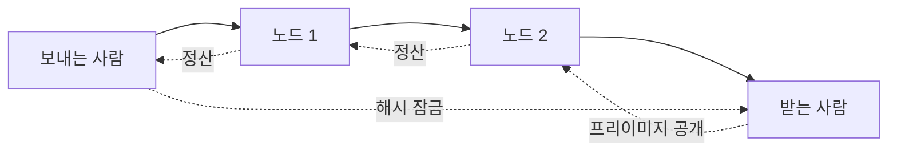

> [!info] 빠른 연결
> 허브: [[06_라이트닝/index]]
> 함께 보기: [[06_라이트닝/BOLT12AMP스플라이싱]] · [[03_업그레이드와_개발/CTVAPOCAT와미래제안]]

라이트닝의 핵심 단위는 채널이다. 채널은 두 참가자가 특정 UTXO를 공유 담보로 묶고, 그 위에서 상태를 갱신해 가는 구조다. HTLC는 이 상태 업데이트를 다중 홉으로 이어 주는 메커니즘으로, 결제 완료 여부를 해시와 시간 제한으로 조절한다. 라우팅은 결국 분산된 채널 그래프 위에서 자금을 목적지까지 전달할 경로를 찾는 문제다.

이 구조는 매우 우아하지만 현실에서는 유동성 배치, inbound/outbound balance, 실패 경로, 수수료 전략, watchtower, channel backup 같은 운영 문제가 따라온다. 기술적 아름다움과 운영 현실이 동시에 존재하는 곳이 바로 라이트닝이다.

## 다중 홉 라이트닝 결제

## 유동성은 왜 중요한가

온체인에서는 단순히 충분한 잔고가 있으면 보낼 수 있지만, 라이트닝에서는 그 잔고가 채널의 어느 쪽에 배치되어 있는지도 중요하다. outbound liquidity가 있어야 보낼 수 있고, inbound liquidity가 있어야 받을 수 있다. 그래서 라이트닝은 잔고가 아니라 **채널 구조의 기하학**을 관리하는 작업에 가깝다.

## 실패는 설계의 일부다

결제가 실패한다고 해서 시스템이 고장 난 것은 아니다. 라우팅 네트워크에서는 경로 탐색 실패, 수수료 mismatch, 유동성 부족이 자연스럽게 일어난다. 좋은 라이트닝 소프트웨어는 이를 사용자에게 지나치게 노출하지 않으면서도, 운영자에게는 충분한 도구를 제공해야 한다.

## 참고 문헌과 원전

- BOLTs documentation.
- Lightning engineering guides.

## 보충 해설

라이트닝 문서는 '빠르고 싼 비트코인 결제'라는 홍보 문구로 읽으면 곧 벽에 부딪힌다. 실제 네트워크는 채널 개설, 유동성 배치, 라우팅 신뢰도, 수취 방식, 온라인 가용성, 워치타워, 구현체 차이 같은 운영적 질문으로 이루어진다. 즉 라이트닝은 단순한 앱 기능이 아니라, 상호 연결된 결제 그래프와 유동성 장치다.

라이트닝을 이해하는 가장 좋은 방법은 온체인과 대립시키지 않는 것이다. 온체인이 최종 결제와 공개 규칙의 층이라면, 라이트닝은 빈번한 교환을 가능하게 하는 상위 레이어다. 그래서 이 폴더에서는 채널이라는 회계 단위와 라우팅이라는 네트워크 단위, 그리고 사용자 경험이라는 서비스 단위를 함께 읽게 된다.

## 라이트닝의 핵심 기구들
채널은 라이트닝의 회계 단위이고, HTLC는 조건부 결제를 여러 홉에 걸쳐 안전하게 연결하는 장치이며, 라우팅은 이 조건부 약속들이 실제 네트워크 위에서 길을 찾는 과정이다. 이 셋을 함께 이해하면 라이트닝이 '신뢰 없이 빠른 결제'를 어떻게 흉내가 아니라 구조로 구현하는지 보인다.

특히 HTLC와 라우팅은 기술적 디테일을 넘어 경제적 함의를 가진다. 경로 실패, 지연, 수수료 누적, 유동성 잠김 같은 현상이 모두 사용성에 영향을 주기 때문이다. 따라서 이 문서는 암호학적 장치와 네트워크 운영이 만나는 지점을 잡아 주는 핵심 노드다.

## 연결해서 읽기

이 문서는 [[06_라이트닝/index]] · [[06_라이트닝/BOLT12AMP스플라이싱]] · [[03_업그레이드와_개발/CTVAPOCAT와미래제안]]와 함께 읽을 때 입체감이 커진다. [[06_라이트닝/index]] 문서는 결제 확장과 유동성 층위를 보강한다 / [[06_라이트닝/BOLT12AMP스플라이싱]] 문서는 결제 확장과 유동성 층위를 보강한다 / [[03_업그레이드와_개발/CTVAPOCAT와미래제안]] 문서는 변경과 구현의 경로 층위를 보강한다. 한 문서를 읽고 바로 이웃 문서로 건너가는 식으로 그래프를 타면, 같은 개념이 철학·기술·운영·역사 중 어느 층에서 다시 등장하는지 빠르게 감이 잡힌다.

특히 채널, HTLC, 라우팅 같은 문서는 단독 정의보다 연결 속에서 의미가 커진다. 비트코인 지식은 선형 교재보다 네트워크 구조에 가깝기 때문에, 인접 노드 한두 개만 함께 읽어도 오해가 크게 줄어드는 경우가 많다.

## 스스로 점검할 질문

이 문서를 읽고 나면 적어도 세 가지 질문에는 자기 언어로 답해 볼 수 있어야 한다. 결제는 왜 실패하는가, 유동성은 어디에 묶이는가, 온체인과 오프체인 경계는 어떻게 관리되는가. 이 질문에 막히는 부분이 있다면 아직 개념 하나가 덜 붙은 것이므로, 바로 옆 문서와 함께 다시 읽는 편이 좋다.
