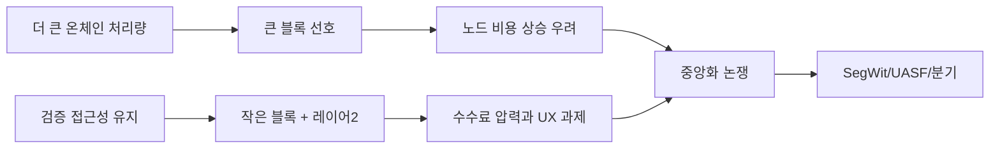

> [!info] 빠른 연결
> 허브: [[08_역사와_논쟁/index]]
> 먼저 읽기: [[02_프로토콜/노드와합의]] · [[02_프로토콜/블록공간과검열저항]]
> 함께 보기: [[03_업그레이드와_개발/SegWit]] · [[03_업그레이드와_개발/소프트포크활성화와UASF]] · [[09_도서와_자료/도서/비트코인 블록사이즈 전쟁]]

블록사이즈 워는 단순히 기술 사양 1MB를 늘릴지 말지에 대한 싸움이 아니었다. 그것은 비트코인이 어떤 종류의 시스템이 될 것인가를 두고 벌어진 **헌법 전쟁**에 가까웠다. 한쪽은 온체인 처리량을 크게 늘려 사용자 경험을 개선하자고 주장했고, 다른 한쪽은 노드 검증 비용 상승이 결국 중앙화를 낳아 비트코인의 핵심 가치인 자기검증 가능성과 검열저항을 훼손한다고 보았다.

이 전쟁의 결과가 중요한 이유는 기술 결론보다 **누가 규칙을 결정하는가**가 드러났기 때문이다. 채굴자, 대기업, 개발자, 거래소가 모두 목소리를 냈지만, 최종적으로는 경제적 노드와 사용자 문화가 네트워크의 방향을 좌우했다. UASF는 그 상징적 사건이다.

## 핵심 구도

## 왜 맥시들에게 결정적이었나

많은 맥시들이 블록사이즈 워를 통해 “비트코인은 코드 이전에 문화”라는 교훈을 얻었다. 돈의 규칙은 편의 때문에 쉽게 바꿔서는 안 되며, 확장은 상위 레이어와 효율화로 해결해야 한다는 감각이 이때 강하게 굳어졌다. 이후 맥시멀리즘의 많은 어조는 사실상 이 전쟁의 기억에서 나온다.

## 원전 기준 핵심 사실

- [[https://github.com/bitcoin/bips/blob/master/bip-0101.mediawiki|BIP101]]은 더 큰 블록을 통한 확장안을 제안했지만 채택되지 않았다.
- [[https://raw.githubusercontent.com/bitcoin/bips/master/bip-0141.mediawiki|BIP141]]은 SegWit의 합의 규칙을 정의했고, [[https://raw.githubusercontent.com/bitcoin/bips/master/bip-0148.mediawiki|BIP148]]은 UASF 방식의 활성화를 제안했다.
- [[https://raw.githubusercontent.com/bitcoin/bips/master/bip-0009.mediawiki|BIP9]]는 version bits 기반 soft fork 배포를 정의했고, 이 메커니즘이 블록사이즈/SegWit 논쟁의 핵심 절차가 되었다.

## 해석

블록사이즈워를 “1MB냐 아니냐”로만 요약하면 사건의 중심을 놓친다. 실제 쟁점은 노드 검증 비용, 활성화 절차, 채굴자 신호의 의미, 사용자와 경제 노드의 힘 관계였다. 따라서 이 전쟁은 기술 분쟁이면서 동시에 거버넌스 분쟁이었다. 다만 “헌법 전쟁”이라는 표현은 해석이며, BIP와 활성화 문서에 기초한 후대적 요약이다.

## 오늘의 의미

오늘날 Ordinals나 covenant, 정책 릴레이, 채굴 검열 같은 논쟁이 나올 때마다 사람들은 블록사이즈 워를 떠올린다. 어떤 변경이든 결국 질문은 같다. 사용성과 기능을 늘리는 대가로 검증 주권을 얼마나 희생하는가.

## 참고 문헌과 원전

- [[https://github.com/bitcoin/bips/blob/master/bip-0101.mediawiki|BIP101]]
- [[https://raw.githubusercontent.com/bitcoin/bips/master/bip-0141.mediawiki|BIP141]]
- [[https://raw.githubusercontent.com/bitcoin/bips/master/bip-0148.mediawiki|BIP148]]
- [[https://raw.githubusercontent.com/bitcoin/bips/master/bip-0009.mediawiki|BIP9]]

## 연결해서 읽기

이 문서는 [[08_역사와_논쟁/index]] · [[02_프로토콜/노드와합의]] · [[02_프로토콜/블록공간과검열저항]]와 함께 읽을 때 입체감이 커진다. [[08_역사와_논쟁/index]]는 역사 프레임을, [[02_프로토콜/노드와합의]]와 [[02_프로토콜/블록공간과검열저항]]은 기술 프레임을 보강한다.

## 스스로 점검할 질문

이 문서를 읽고 나면 적어도 세 가지 질문에는 자기 언어로 답해 볼 수 있어야 한다. 어떤 변화가 기술 논쟁을 거버넌스 전쟁으로 바꾸는가, 어떤 절차가 정당성을 좌우했는가, 오늘의 확장 논쟁은 이 기억을 어떻게 반복하는가.
