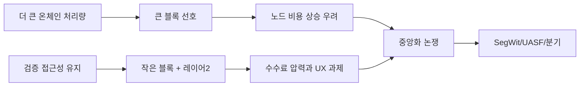

> [!info] 빠른 연결
> 허브: [[08_역사와_논쟁/index]]
> 먼저 읽기: [[02_프로토콜/노드와합의]] · [[02_프로토콜/블록공간과검열저항]]
> 함께 보기: [[03_업그레이드와_개발/SegWit]] · [[03_업그레이드와_개발/소프트포크활성화와UASF]] · [[09_도서와_자료/도서/비트코인 블록사이즈 전쟁]]

블록사이즈 워는 단순히 기술 사양 1MB를 늘릴지 말지에 대한 싸움이 아니었다. 그것은 비트코인이 어떤 종류의 시스템이 될 것인가를 두고 벌어진 **헌법 전쟁**에 가까웠다. 한쪽은 온체인 처리량을 크게 늘려 사용자 경험을 개선하자고 주장했고, 다른 한쪽은 노드 검증 비용 상승이 결국 중앙화를 낳아 비트코인의 핵심 가치인 자기검증 가능성과 검열저항을 훼손한다고 보았다.

이 전쟁의 결과가 중요한 이유는 기술 결론보다 **누가 규칙을 결정하는가**가 드러났기 때문이다. 채굴자, 대기업, 개발자, 거래소가 모두 목소리를 냈지만, 최종적으로는 경제적 노드와 사용자 문화가 네트워크의 방향을 좌우했다. UASF는 그 상징적 사건이다.

## 핵심 구도

## 왜 맥시들에게 결정적이었나

많은 맥시들이 블록사이즈 워를 통해 “비트코인은 코드 이전에 문화”라는 교훈을 얻었다. 돈의 규칙은 편의 때문에 쉽게 바꿔서는 안 되며, 확장은 상위 레이어와 효율화로 해결해야 한다는 감각이 이때 강하게 굳어졌다. 이후 맥시멀리즘의 많은 어조는 사실상 이 전쟁의 기억에서 나온다.

## 오늘의 의미

오늘날 Ordinals나 covenant, 정책 릴레이, 채굴 검열 같은 논쟁이 나올 때마다 사람들은 블록사이즈 워를 떠올린다. 어떤 변경이든 결국 질문은 같다. 사용성과 기능을 늘리는 대가로 검증 주권을 얼마나 희생하는가. 블록사이즈 워는 이 질문을 다시는 잊지 않게 만든 사건이다.

## 보충 해설

역사와 논쟁 문서는 과거 사건을 기록하는 데서 끝나지 않는다. 비트코인 공동체가 어떤 질문을 존재론적 질문으로 취급했는지, 무엇을 절충 가능한 개선으로 보고 무엇을 금기선으로 여겼는지를 보여 주기 때문이다. 블록사이즈워, ETF, 셀프커스터디, 위키리크스, 소프트포크 정치학 같은 이슈는 모두 '비트코인이 무엇이어야 하는가'에 대한 집단적 시험장이었다.

특히 이 폴더는 비트코인의 보수성을 고집이나 느림으로만 읽지 않게 해 준다. 어떤 갈등은 실제로 네트워크의 불변 규범을 세우는 과정이었고, 어떤 편의는 나중에 되돌릴 수 없는 중앙화를 부를 수도 있었다. 역사 문서는 승패를 가르는 경기 요약이 아니라, 오늘의 직관이 어디서 생겼는지를 설명하는 지층 단면이다.

## 비트코인의 헌법이 형성된 전쟁
블록사이즈 워는 단순한 기술 파라미터 다툼이 아니었다. 이는 누가 비트코인의 방향을 결정하는가, 확장성을 위해 무엇을 포기해도 되는가, 노드 비용이 높아지는 것이 얼마나 위험한가, 사용자는 어느 순간 UASF 같은 비정상적 수단으로 저항할 수 있는가 같은 문제를 한꺼번에 드러낸 사건이었다. 그래서 이 전쟁은 현재 비트코인 보수주의의 형성사로 읽힌다.

이 문서를 읽을 때는 양 진영의 슬로건보다 설계 가정을 보는 것이 좋다. 큰 블록은 사용자 경험을 개선할 수 있지만, 노드 운영 비용과 중앙화를 어떻게 바꿀까. 작은 블록과 상위 레이어 전략은 검열 저항을 지킬 수 있지만, 단기 사용성 희생을 얼마나 요구할까. 전쟁의 핵심은 바로 이 trade-off를 어디에 놓느냐였다.

## 연결해서 읽기

이 문서는 [[08_역사와_논쟁/index]] · [[02_프로토콜/노드와합의]] · [[02_프로토콜/블록공간과검열저항]]와 함께 읽을 때 입체감이 커진다. [[08_역사와_논쟁/index]] 문서는 역사적 갈등과 제도화 압력 층위를 보강한다 / [[02_프로토콜/노드와합의]] 문서는 규칙과 검증 구조 층위를 보강한다 / [[02_프로토콜/블록공간과검열저항]] 문서는 규칙과 검증 구조 층위를 보강한다. 한 문서를 읽고 바로 이웃 문서로 건너가는 식으로 그래프를 타면, 같은 개념이 철학·기술·운영·역사 중 어느 층에서 다시 등장하는지 빠르게 감이 잡힌다.

특히 블록사이즈 워 같은 문서는 단독 정의보다 연결 속에서 의미가 커진다. 비트코인 지식은 선형 교재보다 네트워크 구조에 가깝기 때문에, 인접 노드 한두 개만 함께 읽어도 오해가 크게 줄어드는 경우가 많다.

## 스스로 점검할 질문

이 문서를 읽고 나면 적어도 세 가지 질문에는 자기 언어로 답해 볼 수 있어야 한다. 이 사건에서 공동체는 무엇을 비타협적 가치로 보았는가, 어떤 편의가 위험으로 읽혔는가, 그 판단은 오늘 어떻게 남아 있는가. 이 질문에 막히는 부분이 있다면 아직 개념 하나가 덜 붙은 것이므로, 바로 옆 문서와 함께 다시 읽는 편이 좋다.
