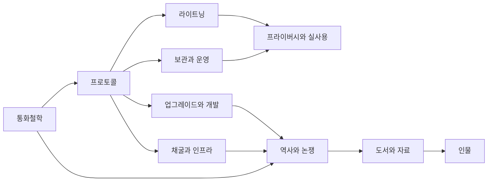

> [!info] 빠른 연결
>
> 웹에서는 Quartz가 그래프 뷰·백링크·검색을 제공하고, 로컬에서는 `content/` 전체를 Obsidian vault로 열면 된다.

이 볼트는 [[01_통화철학/비트코인이란 무엇인가]]에서 시작해 [[02_프로토콜/노드와합의]], [[04_보관과_운영/개인지갑사용가이드]], [[06_라이트닝/라이트닝개요]], [[08_역사와_논쟁/블록사이즈워]]로 이어지는 **비트코인 단일 주제 대위키**다.

설계 원칙은 간단하다. 첫째, 비트코인을 단순한 투자 대상이 아니라 **돈, 네트워크, 사회적 합의, 자기보관 실천**이 겹친 구조물로 본다. 둘째, 기술과 철학을 분리하지 않는다. 셋째, 가능한 한 모든 문서를 서로 촘촘히 엮어 그래프에서 길을 잃지 않도록 만든다.

빠른 입문 순서는 대략 이렇다. **비트코인이란 무엇인가 -> 화폐의 성질 -> 백서 개관 -> UTXO -> 노드와 합의 -> 개인지갑 사용 가이드 -> 라이트닝 개요 -> 블록사이즈 워 -> ATOMIC BITCOIN 추천 도서**.

## 비트코인 지식 우주

## 문서 지도

| 문서 | 초점 |
|---|---|
| [[00_메타/index]] | 읽는 법, 전체 지도, 용어 색인 |
| [[01_통화철학/index]] | 화폐·오스트리아학파·사이퍼펑크·레이어드 머니 |
| [[02_프로토콜/index]] | UTXO·트랜잭션·스크립트·합의·수수료시장 |
| [[03_업그레이드와_개발/index]] | SegWit·Taproot·지갑 표준·covenant 논의 |
| [[04_보관과_운영/index]] | 자기보관·풀노드·하드웨어월렛·상속 |
| [[05_채굴과_인프라/index]] | 채굴·난이도·반감기·에너지·ASIC |
| [[06_라이트닝/index]] | 채널·HTLC·라우팅·실사용 가이드 |
| [[07_프라이버시와_실사용/index]] | Coin Control·KYC 리스크·결제 인프라 |
| [[08_역사와_논쟁/index]] | 사토시 시대·블록사이즈 전쟁·ETF·Ordinals |
| [[09_도서와_자료/index]] | 필독서·원전·필레몬·ATOMIC BITCOIN |
| [[10_인물/index]] | 사토시·할 피니·아담 백·사이페딘 아모스 등 |
