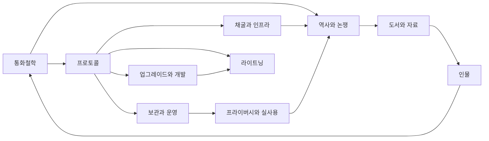

> [!info] 빠른 연결
>
> 웹에서는 Quartz가 그래프 뷰, 백링크, 검색, 폴더 탐색, Mermaid 렌더링을 제공하고, 로컬에서는 `content/` 전체를 Obsidian vault로 열면 된다.

이 볼트는 비트코인을 **가격표가 붙은 자산**으로가 아니라 **돈, 검증 규칙, 셀프커스터디 훈련, 사회적 합의, 에너지 산업, 결제 레이어, 문화 전쟁**이 겹쳐진 구조물로 읽기 위해 설계된 단일 주제 위키다. 중심 축은 [[01_통화철학/비트코인이란 무엇인가]]에서 시작해 [[02_프로토콜/노드와합의]], [[04_보관과_운영/개인지갑사용가이드]], [[06_라이트닝/라이트닝개요]], [[08_역사와_논쟁/블록사이즈워]], [[09_도서와_자료/필레몬·바우키스의비트코인백서해설]]로 이어진다.

이번 증보판의 목표는 세 가지다. 첫째, **맥시멀리스트의 엄격한 관점**을 반영하되 구호 대신 구조적 설명을 준다. 둘째, 개념들을 누락 없이 연결해 그래프 뷰에서 길을 잃지 않게 한다. 셋째, 초심자도 따라올 수 있도록 정의, 역사, 실무, 원전, 논쟁을 한 자리에 배치한다. 그래서 이 위키는 “한 문서에 정답을 적는 사전”이 아니라, **노드에서 노드로 사고가 이동하는 지식 정원**에 가깝다.

## 빠른 입문 경로

1. [[01_통화철학/비트코인이란 무엇인가]]
2. [[01_통화철학/화폐의 성질]]
3. [[02_프로토콜/백서개관]]
4. [[02_프로토콜/UTXO]]
5. [[02_프로토콜/노드와합의]]
6. [[04_보관과_운영/개인지갑사용가이드]]
7. [[06_라이트닝/라이트닝개요]]
8. [[08_역사와_논쟁/블록사이즈워]]
9. [[09_도서와_자료/ATOMIC BITCOIN 추천 도서]]

## 비트코인 지식 우주

## 문서 허브

| 폴더 | 질문 |
|---|---|
| [[00_메타/index]] | 이 위키를 어떻게 읽고, 어디서 시작할 것인가 |
| [[01_통화철학/index]] | 왜 비트코인이 '좋은 돈' 문제와 연결되는가 |
| [[02_프로토콜/index]] | 비트코인은 무엇을 어떻게 검증하는가 |
| [[03_업그레이드와_개발/index]] | 보수적인 돈의 프로토콜은 어떻게 바뀌는가 |
| [[04_보관과_운영/index]] | 남의 약속이 아닌 내 키로 내 재산을 지키려면 무엇을 해야 하는가 |
| [[05_채굴과_인프라/index]] | 작업증명은 어떻게 에너지와 보안을 연결하는가 |
| [[06_라이트닝/index]] | 빠른 결제는 어떤 trade-off를 가져오는가 |
| [[07_프라이버시와_실사용/index]] | 가명성과 실제 생활은 어떻게 양립하는가 |
| [[08_역사와_논쟁/index]] | 비트코인의 헌법 전쟁은 무엇을 남겼는가 |
| [[09_도서와_자료/index]] | 어떤 원전과 어떤 책부터 읽어야 하는가 |
| [[10_인물/index]] | 누가 어떤 층위에서 이 생태계를 밀어왔는가 |

## 읽는 법

- 철학에서 기술로 내려가고 싶다면 [[01_통화철학/index]]에서 출발한다.
- 코드와 구조부터 잡고 싶다면 [[02_프로토콜/index]]에서 출발한다.
- 바로 실사용과 셀프커스터디로 들어가고 싶다면 [[04_보관과_운영/index]]로 간다.
- 맥시멀리스트 문화가 왜 그렇게 형성되었는지 알고 싶다면 [[08_역사와_논쟁/index]]와 [[09_도서와_자료/index]]를 함께 본다.

## 이 위키의 서술 원칙

첫째, 비트코인은 다수의 알트코인 가운데 하나가 아니라, **돈의 성질과 검열저항 네트워크의 조합**으로 다뤄진다. 둘째, 실무 문서는 실제 사고를 줄이는 방향으로 작성한다. 셋째, 논쟁 문서는 어느 편의 표어보다도 **쟁점 구조와 위험 모델**을 우선한다. 넷째, 각 문서는 가능한 한 허브, 인접 개념, 인물, 도서, 가이드로 이어지는 링크를 포함해 그래프 뷰에서 살아 움직이게 만든다.

## 보충 해설

홈 문서는 단순한 목차가 아니라 전체 볼트의 압축판이다. 비트코인을 돈의 철학, 프로토콜, 셀프커스터디, 채굴, 라이트닝, 프라이버시, 역사 논쟁, 독서의 층위로 나누더라도, 실제 이해는 늘 이 층 사이를 왕복하며 자란다. 그래서 홈 문서는 분류와 연결을 동시에 보여 주어야 한다.

좋은 허브는 너무 많은 선택지로 독자를 질식시키지 않으면서도, 어느 지점에서 들어와도 길을 잃지 않게 해야 한다. 이 볼트의 홈 문서는 바로 그 목적을 가진 출발점이다. 한 번에 다 읽기보다, 지금 필요한 질문을 붙잡고 한 갈래를 따라간 뒤 다시 허브로 돌아오는 방식이 가장 생산적이다.

## 이 위키를 하나의 덩어리로 보는 시선
비트코인 위키라는 제목은 단순한 표제가 아니다. 이 볼트는 비트코인을 화폐철학, 프로토콜, 채굴, 라이트닝, 셀프커스터디, 프라이버시, 역사 논쟁, 독서 생태계가 따로 노는 주제가 아니라 하나의 단단한 구조물로 보려는 의도에서 출발한다. 개별 문서가 아무리 훌륭해도 서로 연결되지 않으면 지식은 조각난 상태로 남는다.

따라서 홈 문서의 역할은 모든 답을 담는 것이 아니라, 어느 지점에서 들어와도 전체 구조를 잃지 않게 해 주는 것이다. 입문자는 여기서 경로를 잡고, 중급자는 여기서 인접 노드를 찾아가며, 고급 독자는 여기서 빠진 연결을 스스로 보강할 수 있다. 허브가 단단할수록 위키 전체의 성장 여지도 커진다.

## 연결해서 읽기

이 문서는 [[01_통화철학/비트코인이란 무엇인가]] · [[02_프로토콜/노드와합의]] · [[04_보관과_운영/개인지갑사용가이드]]와 함께 읽을 때 입체감이 커진다. [[01_통화철학/비트코인이란 무엇인가]] 문서는 철학적 전제 층위를 보강한다 / [[02_프로토콜/노드와합의]] 문서는 규칙과 검증 구조 층위를 보강한다 / [[04_보관과_운영/개인지갑사용가이드]] 문서는 셀프커스터디 실무 층위를 보강한다. 한 문서를 읽고 바로 이웃 문서로 건너가는 식으로 그래프를 타면, 같은 개념이 철학·기술·운영·역사 중 어느 층에서 다시 등장하는지 빠르게 감이 잡힌다.

특히 비트코인 위키 같은 허브 문서는 단독 정의보다 연결 속에서 의미가 커진다. 비트코인 지식은 선형 교재보다 네트워크 구조에 가깝기 때문에, 인접 노드 한두 개만 함께 읽어도 오해가 크게 줄어드는 경우가 많다.

## 스스로 점검할 질문

이 문서를 읽고 나면 적어도 세 가지 질문에는 자기 언어로 답해 볼 수 있어야 한다. 이 문서가 풀어 주는 핵심 질문은 무엇인가, 어떤 인접 문서가 이 이해를 교정하는가, 지금 내 공부에서 어디에 연결되는가. 이 질문에 막히는 부분이 있다면 아직 개념 하나가 덜 붙은 것이므로, 바로 옆 문서와 함께 다시 읽는 편이 좋다.

## 보충 메모

'비트코인 위키' 문서는 이 위키에서 전체 허브 축을 지탱하는 노드다. 그래서 핵심 정의만 이해하는 것으로는 충분하지 않고, 그 정의가 다른 문서에서 어떻게 다시 쓰이는지까지 보는 편이 좋다. 비트코인 공부가 어려운 이유는 개념 수가 많아서가 아니라, 같은 개념이 여러 층에서 다른 역할을 맡기 때문이다.

독자가 지금 당장 모든 세부를 기억할 필요는 없다. 다만 이 문서의 문제의식이 왜 [[index]]로 돌아가 다른 갈래와 연결되는지, 그리고 왜 이 문서를 읽은 뒤 다시 실전 문서나 역사 문서로 건너가야 하는지만 분명히 붙잡으면 된다. 그런 식으로 왕복 독서를 할수록 지식은 목록이 아니라 구조가 된다.
